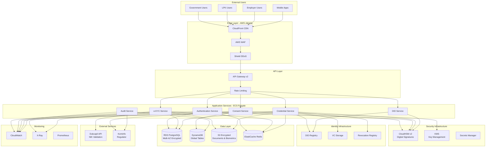
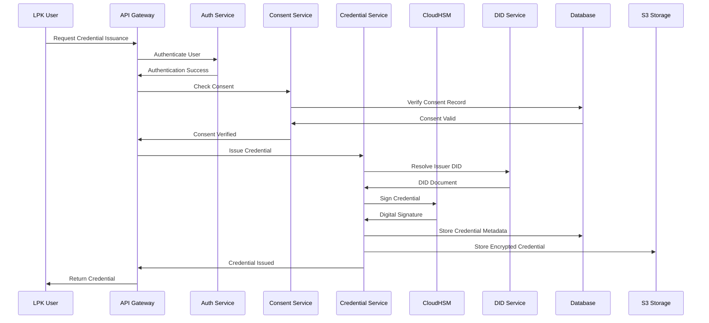
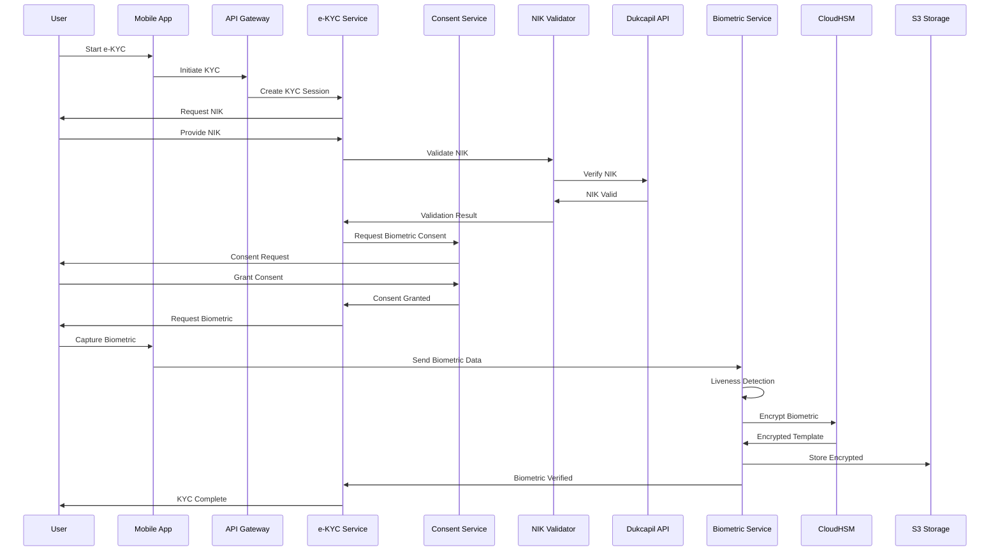
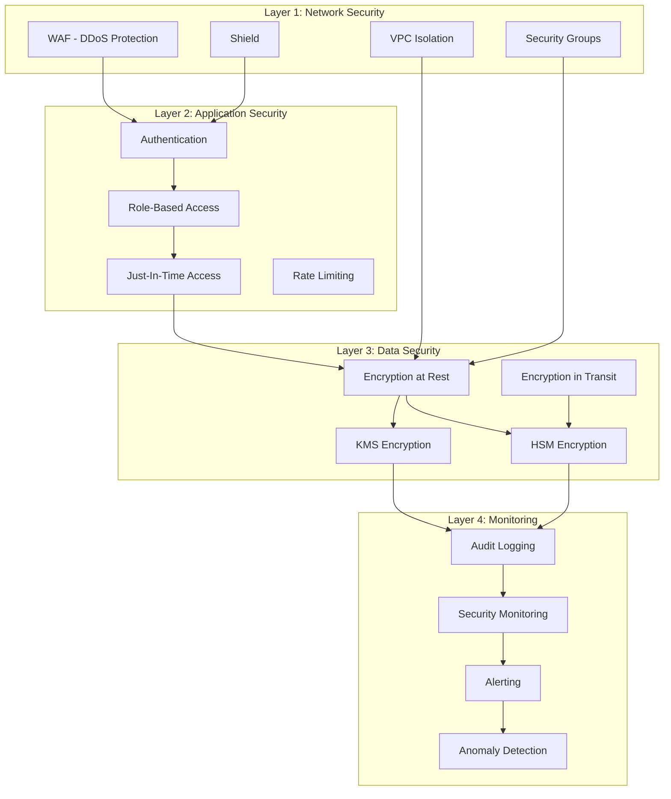
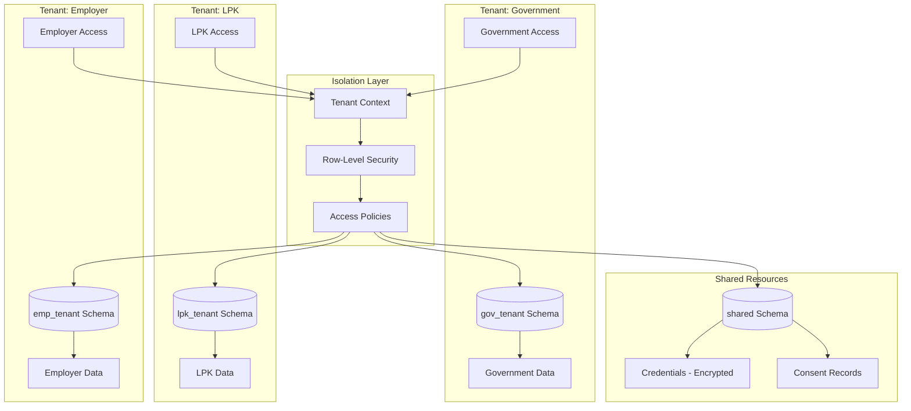
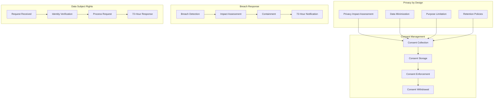

# Architecture Overview

## System Architecture Diagram

## Data Flow: Credential Issuance

## Data Flow: e-KYC Process

## Security Layers

## Multi-Tenancy Isolation

## Compliance Workflow

## Key Performance Indicators

### Infrastructure
- **API Response Time**: < 200ms (p95)
- **Database Query Time**: < 50ms (p95)
- **Credential Issuance**: < 2 seconds
- **Credential Verification**: < 500ms
- **e-KYC Completion**: < 5 minutes

### Security
- **Encryption Coverage**: 100%
- **Access Control Enforcement**: 100%
- **Audit Log Completeness**: 100%
- **Security Incident Response**: < 1 hour

### Compliance
- **Breach Notification**: < 72 hours
- **Data Subject Request Response**: < 72 hours
- **Consent Coverage**: 100%
- **Data Retention Compliance**: 100%

### Availability
- **Uptime**: 99.9%
- **RTO**: 4 hours
- **RPO**: 1 hour
- **Failover Time**: < 5 minutes

## Technology Stack Summary

| Layer | Technology | Purpose |
|-------|-----------|---------|
| **CDN** | CloudFront | Content delivery and caching |
| **WAF** | AWS WAF | Web application firewall |
| **API** | API Gateway v2 | API management and routing |
| **Compute** | ECS Fargate | Container orchestration |
| **Service Mesh** | App Mesh | Service-to-service communication |
| **Database** | RDS PostgreSQL | Primary data store |
| **NoSQL** | DynamoDB | Session and audit logs |
| **Storage** | S3 | Documents and backups |
| **Cache** | ElastiCache Redis | Caching and sessions |
| **HSM** | CloudHSM v2 | Digital signatures and encryption |
| **KMS** | AWS KMS | Key management |
| **Monitoring** | CloudWatch, X-Ray, Prometheus | Observability |
| **Identity** | DID Registry | Decentralized identity |

## Deployment Regions

### Primary: Jakarta (ap-southeast-5)
- All production services
- Multi-AZ deployment
- Primary data storage

### Secondary: Singapore (ap-southeast-1)
- Disaster recovery site
- RDS read replica
- DynamoDB global table replica
- S3 cross-region replication

---

**Last Updated**: 2024-01-15  
**Version**: 1.0.0

