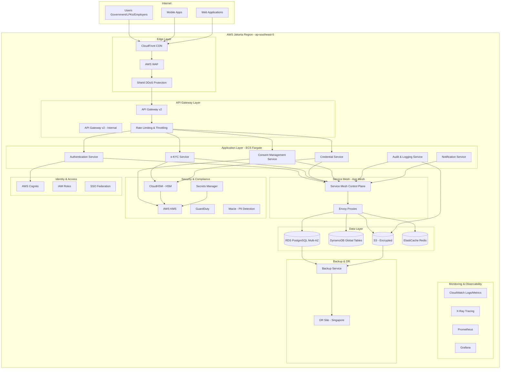
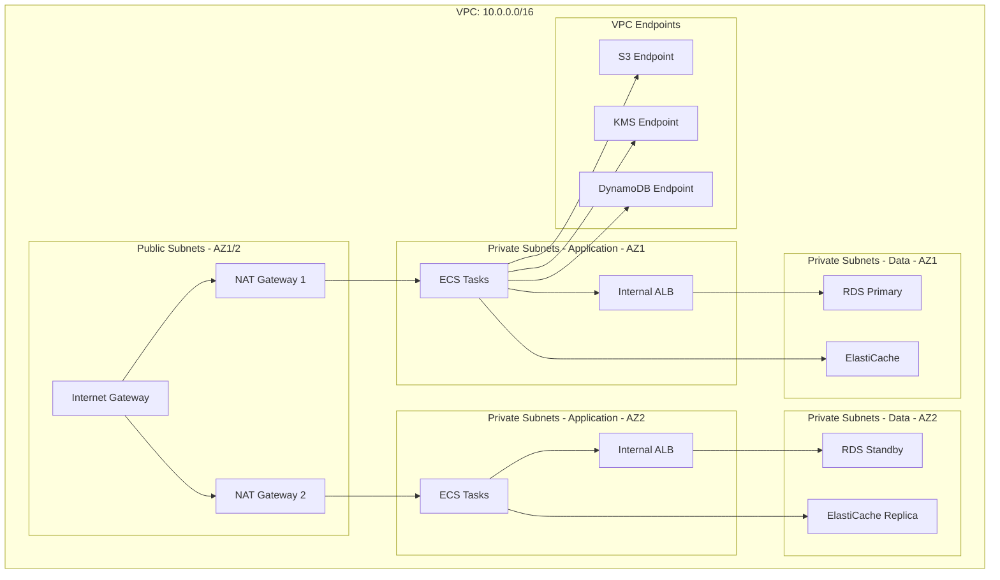
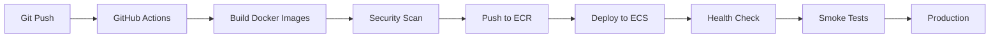

# Infrastructure Design: Multi-Tenant Vocational Platform

## Executive Summary

This document outlines the high-availability cloud architecture for Indonesia's vocational ecosystem platform, designed to support Government, LPKs (Training Providers), and Employers with strict compliance to UU PDP Law No. 27/2022, W3C Verifiable Credentials, and ISO 27001 standards.

## Cloud Provider Selection

### Primary: AWS (Jakarta Region - ap-southeast-5)

**Rationale:**
- Jakarta region provides lowest latency for Indonesian users
- Comprehensive compliance certifications (ISO 27001, SOC 2)
- Native integration with AWS KMS/CloudHSM for HSM requirements
- Mature ECS/Fargate and EKS services
- Strong API Gateway and service mesh capabilities

### Secondary: Google Cloud Platform (Jakarta Region - asia-southeast2-a)

**Fallback Considerations:**
- GKE (Google Kubernetes Engine) for container orchestration
- Cloud Identity and Access Management
- Cloud KMS for key management

## High-Level Architecture



## Detailed Component Architecture

### 1. API Gateway Layer

**AWS API Gateway v2 (HTTP API)**
- **Purpose**: Single entry point for all external requests
- **Features**:
  - JWT authentication validation
  - Request/response transformation
  - Rate limiting per tenant (1000 req/min default)
  - CORS management
  - Request validation
  - API versioning (v1, v2)

**Configuration:**
```yaml
api_gateway:
  type: HTTP_API
  protocol: HTTPS
  authentication:
    - JWT (Cognito)
    - API Keys (for service-to-service)
  rate_limiting:
    default: 1000 req/min
    government: 5000 req/min
    lpk: 2000 req/min
    employer: 1500 req/min
  throttling:
    burst: 2000
    rate: 1000
  cors:
    allowed_origins: ["*.go.id", "*.lpk.id"]
    allowed_methods: ["GET", "POST", "PUT", "DELETE"]
```

### 2. Compute Layer: ECS Fargate

**Why ECS Fargate over EKS:**
- Simpler operational model (no node management)
- Built-in integration with AWS services
- Cost-effective for predictable workloads
- Faster deployment cycles

**Cluster Configuration:**
```yaml
ecs_cluster:
  name: dgihub-production
  capacity_providers:
    - FARGATE
    - FARGATE_SPOT
  services:
    - name: auth-service
      task_count: 3
      cpu: 1024
      memory: 2048
      auto_scaling:
        min: 3
        max: 10
        target_cpu: 70
    - name: ekyc-service
      task_count: 5
      cpu: 2048
      memory: 4096
      auto_scaling:
        min: 5
        max: 20
        target_cpu: 60
    - name: credential-service
      task_count: 4
      cpu: 1024
      memory: 2048
    - name: consent-service
      task_count: 3
      cpu: 512
      memory: 1024
    - name: audit-service
      task_count: 2
      cpu: 512
      memory: 1024
```

**Service Mesh Integration:**
- AWS App Mesh for service-to-service communication
- Envoy proxy sidecar in each task
- mTLS between services
- Circuit breakers and retry policies

### 3. Data Layer

#### 3.1 Relational Database: RDS PostgreSQL

**Configuration:**
- **Engine**: PostgreSQL 15.x
- **Instance**: db.r6g.2xlarge (Multi-AZ)
- **Storage**: 500GB GP3 SSD with auto-scaling
- **Backup**: Automated daily backups, 30-day retention
- **Encryption**: At-rest encryption using KMS
- **High Availability**: Multi-AZ deployment with automatic failover

**Connection Pooling:**
- PgBouncer for connection pooling
- Max connections: 200 per instance
- Connection timeout: 30s

#### 3.2 NoSQL: DynamoDB

**Use Cases:**
- Session management
- Consent records (time-series)
- Audit logs (partitioned by date)
- Rate limiting counters

**Global Tables Configuration:**
- Primary: Jakarta (ap-southeast-5)
- Replica: Singapore (ap-southeast-1) for DR

#### 3.3 Object Storage: S3

**Buckets:**
- `dgihub-documents-prod` - Encrypted documents
- `dgihub-biometrics-prod` - Biometric templates (encrypted)
- `dgihub-backups-prod` - Database backups
- `dgihub-audit-logs-prod` - Compliance audit logs

**Encryption:**
- Server-side encryption (SSE-S3) with KMS
- Versioning enabled
- Lifecycle policies for archival

#### 3.4 Caching: ElastiCache Redis

**Configuration:**
- **Type**: Redis 7.x
- **Node Type**: cache.r6g.large
- **Cluster Mode**: Enabled (3 shards)
- **Use Cases**:
  - Session storage
  - API response caching
  - Rate limiting counters
  - OTP storage (TTL: 5 minutes)

### 4. Security Infrastructure

#### 4.1 Hardware Security Module (HSM)

**AWS CloudHSM Configuration:**
- **Purpose**: Digital signature generation for verifiable credentials
- **HSM Type**: CloudHSM v2
- **Cluster**: 2 HSM instances (High Availability)
- **Key Management**:
  - RSA 2048-bit keys for signing
  - ECDSA P-256 for key derivation
  - Key rotation: Quarterly

**Integration:**
- PKCS#11 library for application integration
- HSM client SDK in credential service
- Key aliases per tenant type

#### 4.2 Key Management: AWS KMS

**Key Hierarchy:**
```
Master Key (KMS)
├── Data Encryption Keys (DEK)
│   ├── Database Encryption
│   ├── S3 Encryption
│   └── Application Secrets
├── Signing Keys (CloudHSM)
│   ├── Government Credentials
│   ├── LPK Credentials
│   └── Employer Credentials
└── API Keys
    ├── Service-to-Service
    └── External Integrations
```

#### 4.3 Secrets Management

**AWS Secrets Manager:**
- Database credentials (automatic rotation)
- API keys for external services
- OAuth client secrets
- HSM credentials

### 5. Network Architecture



**Network Security:**
- Security Groups: Least privilege access
- NACLs: Subnet-level filtering
- VPC Flow Logs: All traffic logging
- AWS PrivateLink: Secure service-to-service communication

### 6. High Availability & Disaster Recovery

#### 6.1 Multi-AZ Deployment
- All services deployed across 2 Availability Zones
- Automatic failover for RDS (Multi-AZ)
- Application Load Balancer with health checks
- Route 53 health checks for DNS failover

#### 6.2 Disaster Recovery Plan

**RTO (Recovery Time Objective):** 4 hours
**RPO (Recovery Point Objective):** 1 hour

**DR Site: Singapore (ap-southeast-1)**
- RDS read replica (promoted to primary on failover)
- DynamoDB global table replica
- S3 cross-region replication
- ECS task definitions and images in ECR
- Route 53 failover routing

**Backup Strategy:**
- **Database**: Automated daily backups + continuous WAL archiving
- **S3**: Cross-region replication + versioning
- **Configuration**: Infrastructure as Code (Terraform) in Git

### 7. Monitoring & Observability

#### 7.1 Logging
- **CloudWatch Logs**: Centralized application logs
- **Log Retention**: 90 days (compliance requirement)
- **Log Encryption**: KMS encryption at rest
- **Structured Logging**: JSON format with correlation IDs

#### 7.2 Metrics
- **CloudWatch Metrics**: System and application metrics
- **Custom Metrics**: Business KPIs, tenant usage
- **Dashboards**: Real-time monitoring dashboards

#### 7.3 Tracing
- **AWS X-Ray**: Distributed tracing
- **Service Map**: Visual service dependencies
- **Performance Insights**: Database query analysis

#### 7.4 Alerting
- **SNS Topics**: Critical alerts
- **PagerDuty Integration**: On-call escalation
- **Alert Categories**:
  - Security incidents
  - Performance degradation
  - Compliance violations
  - Data breach indicators

### 8. Compliance & Governance

#### 8.1 ISO 27001 Alignment
- **Access Control**: IAM roles with least privilege
- **Encryption**: End-to-end encryption (TLS 1.3, at-rest encryption)
- **Audit Logging**: Comprehensive audit trails
- **Change Management**: Infrastructure as Code, approval workflows
- **Incident Response**: Automated incident detection and response

#### 8.2 UU PDP Compliance
- **Data Classification**: Automatic PII detection (Macie)
- **Data Retention**: Automated lifecycle policies
- **Access Logging**: All data access logged
- **Consent Management**: Integrated consent tracking (see separate document)

### 9. Cost Optimization

**Strategies:**
- Reserved Instances for RDS (1-year term)
- Fargate Spot for non-critical workloads
- S3 Intelligent Tiering
- CloudWatch Logs retention policies
- Auto-scaling based on demand
- Right-sizing instances based on metrics

**Estimated Monthly Cost (Production):**
- Compute (ECS Fargate): ~$2,500
- Database (RDS): ~$1,200
- Storage (S3): ~$300
- Network (Data Transfer): ~$200
- Security (CloudHSM, KMS): ~$1,500
- Monitoring: ~$200
- **Total**: ~$5,900/month

## Deployment Strategy

### Infrastructure as Code
- **Terraform**: Infrastructure provisioning
- **GitOps**: Git-based deployment workflow
- **Environments**: Dev, Staging, Production

### CI/CD Pipeline


## Next Steps

1. Set up AWS accounts and organizations
2. Deploy VPC and networking infrastructure
3. Configure CloudHSM cluster
4. Set up RDS and DynamoDB
5. Deploy ECS cluster and services
6. Configure API Gateway
7. Set up monitoring and alerting
8. Implement backup and DR procedures
9. Security hardening and penetration testing
10. Compliance audit preparation


