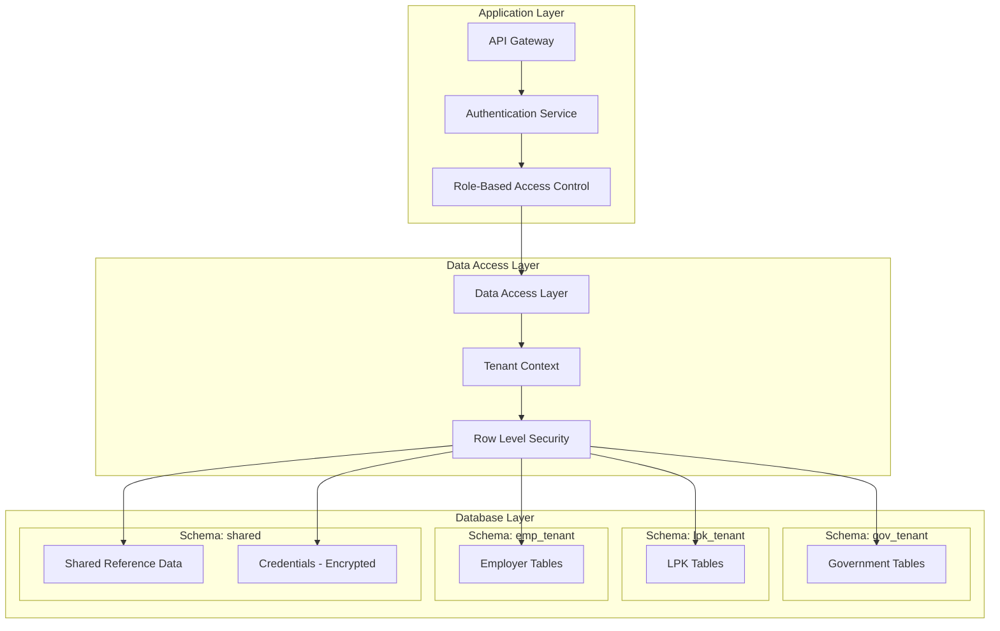
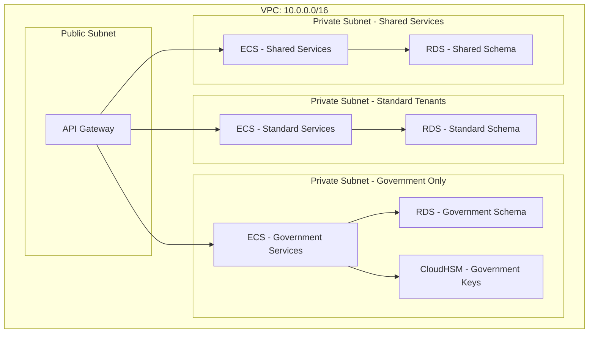

# Multi-Tenancy Data Isolation Strategy

## Overview

This document defines the data isolation strategy for the multi-tenant vocational platform, ensuring complete separation between Government, LPKs (Training Providers), and Employers while maintaining compliance with UU PDP Law No. 27/2022.

## Tenant Types

### 1. Government (Tenant Type: `GOV`)
- **Scope**: National and regional government entities
- **Data Access**: Read/write access to all vocational data within jurisdiction
- **Special Permissions**: Can issue official credentials, view aggregated statistics

### 2. LPK - Lembaga Pelatihan Kerja (Tenant Type: `LPK`)
- **Scope**: Training providers and vocational institutions
- **Data Access**: 
  - Read/write: Their own training programs and participants
  - Read-only: Public credential information (with consent)
- **Special Permissions**: Can issue training completion certificates

### 3. Employer (Tenant Type: `EMP`)
- **Scope**: Companies and organizations hiring vocational graduates
- **Data Access**:
  - Read-only: Candidate credentials (with explicit consent)
  - Write: Job postings, hiring decisions
- **Special Permissions**: Can request credential verification

## Data Isolation Models

### Hybrid Approach: Database-Level + Application-Level Isolation

We use a **hybrid isolation model** combining:
1. **Logical separation** at the database level (schema-based)
2. **Application-level enforcement** (row-level security)
3. **Network-level isolation** (VPC segmentation for sensitive tenants)



## Database Schema Design

### Schema Structure

```sql
-- Tenant-specific schemas
CREATE SCHEMA gov_tenant;
CREATE SCHEMA lpk_tenant;
CREATE SCHEMA emp_tenant;

-- Shared schema for cross-tenant data (with encryption)
CREATE SCHEMA shared;

-- System schema for tenant management
CREATE SCHEMA system;
```

### Tenant Management Table

```sql
CREATE TABLE system.tenants (
    tenant_id UUID PRIMARY KEY DEFAULT gen_random_uuid(),
    tenant_type VARCHAR(10) NOT NULL CHECK (tenant_type IN ('GOV', 'LPK', 'EMP')),
    tenant_code VARCHAR(50) UNIQUE NOT NULL,
    organization_name VARCHAR(255) NOT NULL,
    registration_number VARCHAR(100),
    status VARCHAR(20) DEFAULT 'ACTIVE',
    created_at TIMESTAMP DEFAULT CURRENT_TIMESTAMP,
    updated_at TIMESTAMP DEFAULT CURRENT_TIMESTAMP,
    metadata JSONB
);

CREATE INDEX idx_tenants_type ON system.tenants(tenant_type);
CREATE INDEX idx_tenants_code ON system.tenants(tenant_code);
```

### Row-Level Security (RLS) Implementation

#### Example: LPK Training Programs Table

```sql
CREATE TABLE lpk_tenant.training_programs (
    program_id UUID PRIMARY KEY DEFAULT gen_random_uuid(),
    tenant_id UUID NOT NULL REFERENCES system.tenants(tenant_id),
    program_name VARCHAR(255) NOT NULL,
    description TEXT,
    duration_days INTEGER,
    created_at TIMESTAMP DEFAULT CURRENT_TIMESTAMP,
    CONSTRAINT fk_tenant FOREIGN KEY (tenant_id) REFERENCES system.tenants(tenant_id)
);

-- Enable RLS
ALTER TABLE lpk_tenant.training_programs ENABLE ROW LEVEL SECURITY;

-- Policy: LPKs can only see their own programs
CREATE POLICY lpk_programs_isolation ON lpk_tenant.training_programs
    FOR ALL
    USING (tenant_id = current_setting('app.current_tenant_id')::UUID);

-- Policy: Government can read all LPK programs (with audit)
CREATE POLICY gov_read_lpk_programs ON lpk_tenant.training_programs
    FOR SELECT
    USING (
        EXISTS (
            SELECT 1 FROM system.tenants t
            WHERE t.tenant_id = current_setting('app.current_tenant_id')::UUID
            AND t.tenant_type = 'GOV'
        )
    );
```

### Shared Credentials Table (Encrypted)

```sql
CREATE TABLE shared.verifiable_credentials (
    credential_id UUID PRIMARY KEY DEFAULT gen_random_uuid(),
    holder_id VARCHAR(50) NOT NULL, -- NIK or identifier
    issuer_tenant_id UUID NOT NULL REFERENCES system.tenants(tenant_id),
    credential_type VARCHAR(50) NOT NULL,
    credential_data JSONB NOT NULL, -- Encrypted JSON
    encrypted_key_id VARCHAR(255), -- KMS key ID
    status VARCHAR(20) DEFAULT 'ACTIVE',
    issued_at TIMESTAMP DEFAULT CURRENT_TIMESTAMP,
    expires_at TIMESTAMP,
    revocation_reason TEXT,
    CONSTRAINT fk_issuer FOREIGN KEY (issuer_tenant_id) REFERENCES system.tenants(tenant_id)
);

-- Encryption at application level using AWS KMS
-- credential_data is encrypted before insertion
```

## Application-Level Isolation

### Tenant Context Middleware

```python
# Pseudo-code for tenant context middleware
class TenantContextMiddleware:
    def __init__(self):
        self.tenant_resolver = TenantResolver()
    
    async def process_request(self, request):
        # Extract tenant from JWT token or subdomain
        tenant_id = self.extract_tenant_id(request)
        
        # Validate tenant access
        if not self.validate_tenant_access(request.user, tenant_id):
            raise ForbiddenError("Access denied to this tenant")
        
        # Set tenant context for database queries
        await self.set_tenant_context(tenant_id)
        
        # Add tenant_id to request context
        request.tenant_id = tenant_id
        request.tenant_type = await self.get_tenant_type(tenant_id)
```

### Data Access Layer with Automatic Filtering

```python
class TenantAwareRepository:
    def __init__(self, db_session, tenant_id):
        self.db = db_session
        self.tenant_id = tenant_id
    
    async def get_training_programs(self):
        # Automatically filters by tenant_id
        query = """
            SELECT * FROM lpk_tenant.training_programs
            WHERE tenant_id = :tenant_id
        """
        return await self.db.execute(
            query, 
            {"tenant_id": self.tenant_id}
        )
    
    async def create_training_program(self, program_data):
        # Automatically injects tenant_id
        program_data['tenant_id'] = self.tenant_id
        return await self.db.insert('lpk_tenant.training_programs', program_data)
```

## Cross-Tenant Data Access Rules

### Credential Sharing Matrix

| From Tenant | To Tenant | Access Level | Consent Required |
|------------|-----------|--------------|------------------|
| LPK | Employer | Read (specific credentials) | Yes (explicit) |
| LPK | Government | Read (all credentials) | No (legal requirement) |
| Government | LPK | Read (aggregated stats only) | No |
| Government | Employer | Read (aggregated stats only) | No |
| Employer | LPK | None | N/A |
| Employer | Government | Read (hiring data) | No (legal requirement) |

### Consent-Based Access Implementation

```sql
CREATE TABLE shared.consent_records (
    consent_id UUID PRIMARY KEY DEFAULT gen_random_uuid(),
    data_subject_id VARCHAR(50) NOT NULL, -- NIK
    data_controller_tenant_id UUID NOT NULL, -- Who holds the data
    data_processor_tenant_id UUID NOT NULL, -- Who wants access
    consent_type VARCHAR(50) NOT NULL, -- 'CREDENTIAL_SHARE', 'BIOMETRIC', etc.
    consent_status VARCHAR(20) DEFAULT 'PENDING', -- PENDING, GRANTED, REVOKED
    granted_at TIMESTAMP,
    revoked_at TIMESTAMP,
    expiry_date TIMESTAMP,
    purpose TEXT NOT NULL,
    legal_basis VARCHAR(100), -- 'CONSENT', 'LEGAL_OBLIGATION', etc.
    created_at TIMESTAMP DEFAULT CURRENT_TIMESTAMP,
    CONSTRAINT fk_controller FOREIGN KEY (data_controller_tenant_id) 
        REFERENCES system.tenants(tenant_id),
    CONSTRAINT fk_processor FOREIGN KEY (data_processor_tenant_id) 
        REFERENCES system.tenants(tenant_id)
);

CREATE INDEX idx_consent_subject ON shared.consent_records(data_subject_id);
CREATE INDEX idx_consent_status ON shared.consent_records(consent_status);
```

### Access Control Logic

```python
class CredentialAccessController:
    async def can_access_credential(
        self, 
        requesting_tenant_id: UUID,
        credential_id: UUID,
        purpose: str
    ) -> bool:
        credential = await self.get_credential(credential_id)
        holder_id = credential.holder_id
        issuer_tenant_id = credential.issuer_tenant_id
        
        # Government always has access (legal requirement)
        if self.is_government_tenant(requesting_tenant_id):
            return True
        
        # Issuer can always access their own credentials
        if requesting_tenant_id == issuer_tenant_id:
            return True
        
        # Check for valid consent
        consent = await self.get_valid_consent(
            data_subject_id=holder_id,
            data_controller_tenant_id=issuer_tenant_id,
            data_processor_tenant_id=requesting_tenant_id,
            consent_type='CREDENTIAL_SHARE',
            purpose=purpose
        )
        
        return consent is not None and consent.consent_status == 'GRANTED'
```

## Network-Level Isolation

### VPC Segmentation



**Security Groups:**
- Standard tenants: Can only access standard subnet resources
- Government: Can access both government and shared resources
- Shared services: Can access shared resources only

## Data Encryption Strategy

### Encryption at Rest

1. **Database Level**: RDS encryption using AWS KMS
2. **Application Level**: Sensitive fields encrypted before storage
3. **S3 Level**: Server-side encryption with KMS

### Encryption in Transit

- TLS 1.3 for all external communications
- mTLS for service-to-service communication (via App Mesh)

### Field-Level Encryption

```python
class EncryptedField:
    def __init__(self, kms_key_id: str):
        self.kms_client = boto3.client('kms')
        self.key_id = kms_key_id
    
    def encrypt(self, plaintext: str) -> dict:
        """Encrypt sensitive data using KMS"""
        response = self.kms_client.encrypt(
            KeyId=self.key_id,
            Plaintext=plaintext.encode('utf-8')
        )
        return {
            'encrypted_data': base64.b64encode(response['CiphertextBlob']).decode(),
            'key_id': self.key_id
        }
    
    def decrypt(self, encrypted_data: dict) -> str:
        """Decrypt data using KMS"""
        ciphertext = base64.b64decode(encrypted_data['encrypted_data'])
        response = self.kms_client.decrypt(
            CiphertextBlob=ciphertext,
            KeyId=encrypted_data['key_id']
        )
        return response['Plaintext'].decode('utf-8')
```

## Audit Logging

### Comprehensive Audit Trail

```sql
CREATE TABLE system.audit_logs (
    audit_id UUID PRIMARY KEY DEFAULT gen_random_uuid(),
    tenant_id UUID REFERENCES system.tenants(tenant_id),
    user_id UUID,
    action VARCHAR(50) NOT NULL, -- 'CREATE', 'READ', 'UPDATE', 'DELETE', 'EXPORT'
    resource_type VARCHAR(50) NOT NULL,
    resource_id UUID,
    ip_address INET,
    user_agent TEXT,
    request_id VARCHAR(100),
    success BOOLEAN DEFAULT TRUE,
    error_message TEXT,
    metadata JSONB,
    created_at TIMESTAMP DEFAULT CURRENT_TIMESTAMP
);

CREATE INDEX idx_audit_tenant ON system.audit_logs(tenant_id, created_at);
CREATE INDEX idx_audit_user ON system.audit_logs(user_id, created_at);
CREATE INDEX idx_audit_resource ON system.audit_logs(resource_type, resource_id);
```

**Audit Requirements:**
- All data access logged (read, write, delete)
- Cross-tenant access logged with purpose
- Data export logged with recipient information
- Failed access attempts logged
- Retention: 7 years (UU PDP requirement)

## Data Retention and Deletion

### Retention Policies by Tenant Type

| Data Type | Government | LPK | Employer | Retention Period |
|-----------|-----------|-----|----------|------------------|
| Training Records | Indefinite | 10 years | N/A | Legal requirement |
| Credentials | Indefinite | 10 years | 5 years | Legal requirement |
| Consent Records | 7 years | 7 years | 7 years | UU PDP requirement |
| Audit Logs | 7 years | 7 years | 7 years | UU PDP requirement |
| Biometric Data | 1 year (after consent expiry) | 1 year | N/A | UU PDP requirement |

### Automated Deletion Process

```python
class DataRetentionManager:
    async def execute_retention_policy(self):
        """Run daily to enforce retention policies"""
        
        # Delete expired biometric data
        await self.delete_expired_biometrics()
        
        # Archive old audit logs to S3
        await self.archive_old_audit_logs()
        
        # Soft delete expired credentials
        await self.soft_delete_expired_credentials()
        
        # Hard delete after grace period
        await self.hard_delete_after_grace_period()
```

## Testing Multi-Tenancy Isolation

### Isolation Test Suite

```python
async def test_tenant_isolation():
    """Verify tenants cannot access each other's data"""
    
    # Create two LPK tenants
    lpk1 = await create_tenant('LPK', 'LPK001')
    lpk2 = await create_tenant('LPK', 'LPK002')
    
    # Create training program for LPK1
    program1 = await create_training_program(lpk1.tenant_id, "Program 1")
    
    # LPK2 should not be able to access LPK1's program
    with pytest.raises(ForbiddenError):
        await get_training_program(lpk2.tenant_id, program1.id)
    
    # LPK1 should be able to access their own program
    program = await get_training_program(lpk1.tenant_id, program1.id)
    assert program is not None
```

## Compliance Considerations

### UU PDP Article 26: Data Processing Limitation
- Data processed only for specified purposes
- Cross-tenant access requires explicit consent
- Government access logged for audit

### UU PDP Article 27: Data Security
- Encryption at rest and in transit
- Access controls enforced at multiple layers
- Regular security audits

### UU PDP Article 28: Data Breach Notification
- Tenant-specific breach detection
- Isolated impact assessment per tenant
- Targeted notification to affected data subjects

## Performance Optimization

### Query Optimization
- Tenant-specific indexes
- Partitioning by tenant_id for large tables
- Connection pooling per tenant type

### Caching Strategy
- Tenant-scoped cache keys
- Redis namespaces per tenant
- Cache invalidation on tenant data changes

## Migration Strategy

### Phase 1: Schema Setup
1. Create tenant schemas
2. Migrate existing data to appropriate schemas
3. Set up RLS policies

### Phase 2: Application Updates
1. Implement tenant context middleware
2. Update data access layer
3. Add audit logging

### Phase 3: Testing
1. Isolation testing
2. Performance testing
3. Security penetration testing

### Phase 4: Rollout
1. Gradual migration of tenants
2. Monitoring and validation
3. Full rollout


