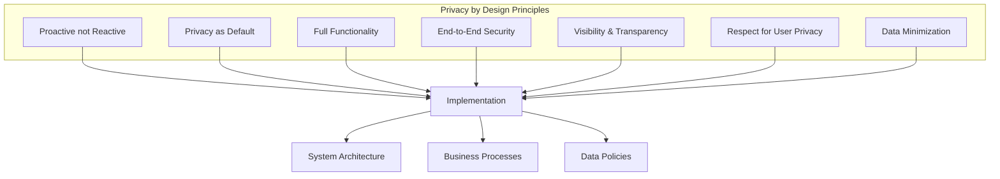
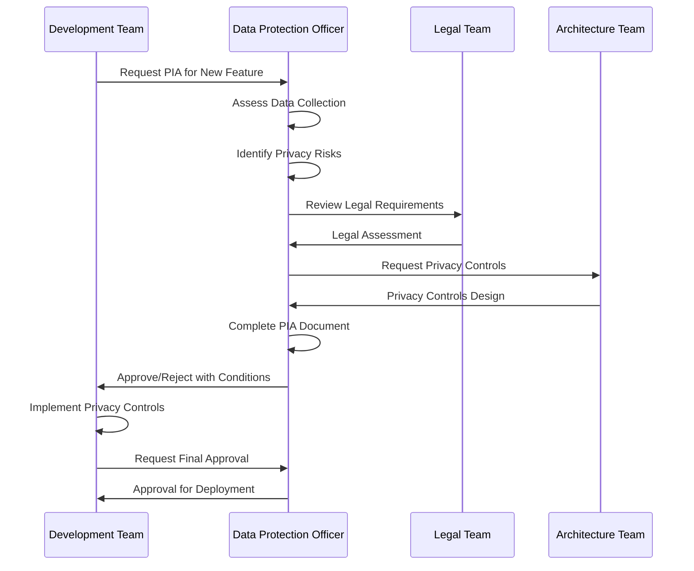
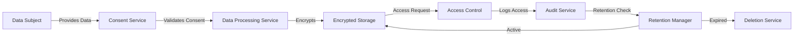
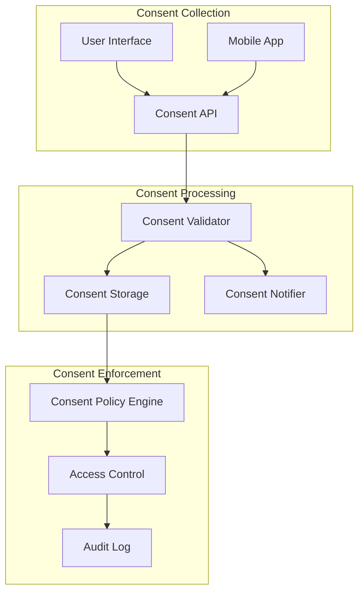
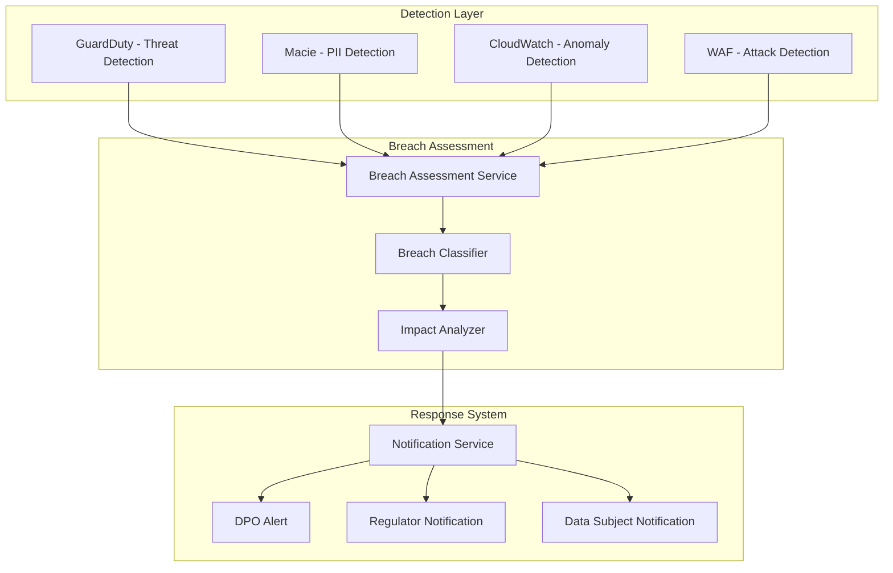
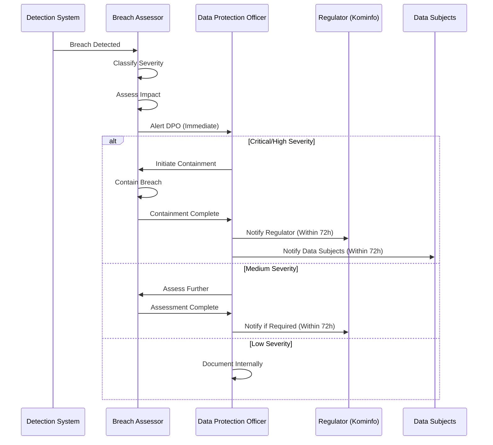

# UU PDP Law No. 27/2022 Compliance Framework

## Executive Summary

This document outlines the comprehensive compliance framework for Indonesia's Personal Data Protection Law (UU PDP) No. 27/2022, ensuring Privacy by Design principles, consent management, and rapid breach response capabilities.

## Legal Framework Overview

### Key UU PDP Articles Relevant to Platform

| Article | Requirement | Implementation |
|---------|-------------|----------------|
| Art. 20 | Privacy by Design | Built into architecture from ground up |
| Art. 21 | Consent Management | Explicit consent system for all PII processing |
| Art. 22 | Children's Data Protection | Special handling for data subjects under 18 |
| Art. 23 | Biometric Data Protection | Enhanced security and consent for biometrics |
| Art. 24 | Data Breach Notification | 72-hour notification system |
| Art. 25 | Data Subject Rights | Access, rectification, erasure, portability |
| Art. 26 | Data Processing Limitation | Purpose limitation and data minimization |
| Art. 27 | Data Security | Encryption, access controls, audit trails |
| Art. 28 | Data Retention | Automated retention and deletion policies |

## 1. Privacy by Design Workflow

### 1.1 Design Principles



### 1.2 Privacy Impact Assessment (PIA) Process



### 1.3 Data Flow Mapping

**Standard Data Flow:**
```
Data Subject → Consent Collection → Data Processing → Storage (Encrypted) → Access Control → Audit Logging → Retention/Deletion
```

**Detailed Flow Diagram:**



### 1.4 Privacy Controls Implementation

#### Data Minimization
- Collect only necessary data fields
- Automatic data field validation
- Purpose-based data collection forms

#### Purpose Limitation
```python
class PurposeLimitation:
    """Enforce purpose limitation for data processing"""
    
    ALLOWED_PURPOSES = {
        'CREDENTIAL_ISSUANCE': ['name', 'nik', 'training_completion'],
        'EMPLOYMENT_VERIFICATION': ['name', 'credential_id', 'issuance_date'],
        'STATISTICAL_ANALYSIS': ['aggregated_data_only']
    }
    
    def validate_purpose(self, purpose: str, data_fields: list) -> bool:
        """Validate that only required fields are collected for purpose"""
        allowed_fields = self.ALLOWED_PURPOSES.get(purpose, [])
        return all(field in allowed_fields for field in data_fields)
```

#### Storage Limitation
- Automatic data expiration based on retention policies
- Scheduled deletion jobs
- Archive to cold storage before deletion

## 2. Consent Management System

### 2.1 Consent Architecture



### 2.2 Consent Data Model

```sql
CREATE TABLE shared.consents (
    consent_id UUID PRIMARY KEY DEFAULT gen_random_uuid(),
    data_subject_id VARCHAR(50) NOT NULL, -- NIK
    data_subject_type VARCHAR(20) NOT NULL CHECK (data_subject_type IN ('ADULT', 'CHILD')),
    data_controller_tenant_id UUID NOT NULL REFERENCES system.tenants(tenant_id),
    consent_type VARCHAR(50) NOT NULL, -- 'BIOMETRIC', 'CREDENTIAL_SHARE', 'PROFILING', etc.
    purpose TEXT NOT NULL,
    legal_basis VARCHAR(100) NOT NULL, -- 'CONSENT', 'CONTRACT', 'LEGAL_OBLIGATION', 'VITAL_INTERESTS', 'PUBLIC_TASK', 'LEGITIMATE_INTERESTS'
    
    -- Consent Status
    status VARCHAR(20) DEFAULT 'PENDING' CHECK (status IN ('PENDING', 'GRANTED', 'DENIED', 'WITHDRAWN', 'EXPIRED')),
    granted_at TIMESTAMP,
    withdrawn_at TIMESTAMP,
    expires_at TIMESTAMP,
    
    -- Granular Consent
    consent_granularity JSONB, -- Specific data fields consented
    processing_activities JSONB, -- What can be done with data
    
    -- Children's Consent
    guardian_consent_id UUID REFERENCES shared.consents(consent_id), -- For children
    guardian_verified BOOLEAN DEFAULT FALSE,
    
    -- Audit
    ip_address INET,
    user_agent TEXT,
    consent_method VARCHAR(50), -- 'WEB', 'MOBILE', 'API', 'IN_PERSON'
    consent_version INTEGER DEFAULT 1,
    previous_consent_id UUID REFERENCES shared.consents(consent_id),
    
    created_at TIMESTAMP DEFAULT CURRENT_TIMESTAMP,
    updated_at TIMESTAMP DEFAULT CURRENT_TIMESTAMP,
    
    CONSTRAINT fk_controller FOREIGN KEY (data_controller_tenant_id) 
        REFERENCES system.tenants(tenant_id)
);

CREATE INDEX idx_consent_subject ON shared.consents(data_subject_id, status);
CREATE INDEX idx_consent_type ON shared.consents(consent_type, status);
CREATE INDEX idx_consent_expiry ON shared.consents(expires_at) WHERE status = 'GRANTED';
```

### 2.3 Consent Collection Workflow

```python
class ConsentManager:
    """Manages consent lifecycle"""
    
    async def request_consent(
        self,
        data_subject_id: str,
        data_subject_type: str,
        consent_type: str,
        purpose: str,
        legal_basis: str,
        granularity: dict,
        expires_in_days: int = 365
    ) -> Consent:
        """Request consent from data subject"""
        
        # Check if data subject is a child
        if data_subject_type == 'CHILD':
            return await self.request_guardian_consent(
                data_subject_id, consent_type, purpose, legal_basis, granularity
            )
        
        # Create consent record
        consent = Consent(
            data_subject_id=data_subject_id,
            data_subject_type=data_subject_type,
            consent_type=consent_type,
            purpose=purpose,
            legal_basis=legal_basis,
            consent_granularity=granularity,
            status='PENDING',
            expires_at=datetime.now() + timedelta(days=expires_in_days)
        )
        
        # Send consent request notification
        await self.send_consent_request(consent)
        
        return consent
    
    async def grant_consent(
        self,
        consent_id: UUID,
        ip_address: str,
        user_agent: str,
        consent_method: str
    ) -> Consent:
        """Record consent grant"""
        
        consent = await self.get_consent(consent_id)
        
        if consent.status != 'PENDING':
            raise InvalidConsentStateError("Consent already processed")
        
        # Validate consent is not expired
        if consent.expires_at < datetime.now():
            raise ConsentExpiredError("Consent request has expired")
        
        # Update consent
        consent.status = 'GRANTED'
        consent.granted_at = datetime.now()
        consent.ip_address = ip_address
        consent.user_agent = user_agent
        consent.consent_method = consent_method
        
        await self.save_consent(consent)
        
        # Log consent grant
        await self.audit_log.record_consent_grant(consent)
        
        # Notify data controller
        await self.notify_consent_granted(consent)
        
        return consent
    
    async def withdraw_consent(
        self,
        consent_id: UUID,
        reason: str = None
    ) -> Consent:
        """Withdraw consent"""
        
        consent = await self.get_consent(consent_id)
        
        if consent.status != 'GRANTED':
            raise InvalidConsentStateError("Consent not granted")
        
        consent.status = 'WITHDRAWN'
        consent.withdrawn_at = datetime.now()
        
        await self.save_consent(consent)
        
        # Stop all processing activities
        await self.stop_processing_activities(consent)
        
        # Schedule data deletion if required
        if consent.consent_type in ['BIOMETRIC', 'PROFILING']:
            await self.schedule_data_deletion(consent)
        
        # Log withdrawal
        await self.audit_log.record_consent_withdrawal(consent, reason)
        
        return consent
```

### 2.4 Biometric Data Consent

**Special Requirements for Biometric Data (UU PDP Art. 23):**

```python
class BiometricConsentManager(ConsentManager):
    """Special handling for biometric data consent"""
    
    REQUIRED_CONSENT_FIELDS = [
        'purpose',
        'retention_period',
        'security_measures',
        'third_party_sharing',
        'withdrawal_rights'
    ]
    
    async def request_biometric_consent(
        self,
        data_subject_id: str,
        biometric_type: str,  # 'FINGERPRINT', 'FACE', 'IRIS', 'VOICE'
        purpose: str,
        retention_days: int = 365
    ) -> Consent:
        """Request consent for biometric data collection"""
        
        # Enhanced consent requirements for biometrics
        granularity = {
            'biometric_type': biometric_type,
            'retention_period_days': retention_days,
            'security_measures': 'HSM_ENCRYPTED',
            'third_party_sharing': False,
            'withdrawal_rights': True,
            'deletion_on_withdrawal': True
        }
        
        consent = await self.request_consent(
            data_subject_id=data_subject_id,
            data_subject_type='ADULT',  # Biometric consent only for adults
            consent_type='BIOMETRIC',
            purpose=purpose,
            legal_basis='CONSENT',  # Must be explicit consent
            granularity=granularity,
            expires_in_days=retention_days
        )
        
        # Additional validation
        if retention_days > 365:
            raise InvalidRetentionPeriodError("Biometric data retention cannot exceed 1 year")
        
        return consent
```

### 2.5 Children's Data Consent (UU PDP Art. 22)

```python
class ChildrenConsentManager(ConsentManager):
    """Special handling for children's data (under 18)"""
    
    async def request_guardian_consent(
        self,
        child_nik: str,
        guardian_nik: str,
        consent_type: str,
        purpose: str,
        legal_basis: str,
        granularity: dict
    ) -> Consent:
        """Request consent from guardian for child's data"""
        
        # Verify guardian relationship
        guardian_verified = await self.verify_guardian_relationship(
            child_nik, guardian_nik
        )
        
        if not guardian_verified:
            raise GuardianVerificationError("Guardian relationship not verified")
        
        # Create child consent
        child_consent = Consent(
            data_subject_id=child_nik,
            data_subject_type='CHILD',
            consent_type=consent_type,
            purpose=purpose,
            legal_basis=legal_basis,
            consent_granularity=granularity,
            status='PENDING',
            guardian_consent_id=None,  # Will be set when guardian grants
            guardian_verified=False
        )
        
        await self.save_consent(child_consent)
        
        # Request consent from guardian
        guardian_consent = await self.request_consent(
            data_subject_id=guardian_nik,
            data_subject_type='ADULT',
            consent_type=f'GUARDIAN_{consent_type}',
            purpose=f"Guardian consent for {purpose}",
            legal_basis='LEGAL_OBLIGATION',
            granularity={
                'child_nik': child_nik,
                'child_consent_id': str(child_consent.consent_id),
                **granularity
            }
        )
        
        # Link guardian consent to child consent
        child_consent.guardian_consent_id = guardian_consent.consent_id
        await self.save_consent(child_consent)
        
        return child_consent
    
    async def verify_guardian_relationship(
        self,
        child_nik: str,
        guardian_nik: str
    ) -> bool:
        """Verify guardian relationship via government database"""
        
        # Integration with Dukcapil (Civil Registry) API
        relationship = await self.dukcapil_api.verify_relationship(
            child_nik, guardian_nik
        )
        
        return relationship in ['PARENT', 'LEGAL_GUARDIAN']
```

### 2.6 Consent Enforcement

```python
class ConsentPolicyEngine:
    """Enforces consent policies for data access"""
    
    async def check_consent(
        self,
        data_subject_id: str,
        consent_type: str,
        purpose: str,
        tenant_id: UUID
    ) -> bool:
        """Check if valid consent exists"""
        
        # Get active consent
        consent = await self.get_active_consent(
            data_subject_id=data_subject_id,
            consent_type=consent_type,
            data_controller_tenant_id=tenant_id
        )
        
        if not consent:
            return False
        
        if consent.status != 'GRANTED':
            return False
        
        if consent.expires_at < datetime.now():
            # Auto-expire consent
            await self.expire_consent(consent.consent_id)
            return False
        
        # Verify purpose matches
        if purpose not in consent.purpose:
            return False
        
        return True
    
    async def enforce_consent_for_processing(
        self,
        data_subject_id: str,
        processing_activity: str,
        tenant_id: UUID
    ) -> bool:
        """Enforce consent before data processing"""
        
        consent_type = self.map_processing_to_consent_type(processing_activity)
        
        if not await self.check_consent(data_subject_id, consent_type, processing_activity, tenant_id):
            raise ConsentRequiredError(
                f"Consent required for {processing_activity} on data subject {data_subject_id}"
            )
        
        # Log consent usage
        await self.audit_log.record_consent_usage(
            data_subject_id, consent_type, processing_activity, tenant_id
        )
        
        return True
```

## 3. Data Breach Response System

### 3.1 Breach Detection Architecture



### 3.2 Breach Data Model

```sql
CREATE TABLE system.data_breaches (
    breach_id UUID PRIMARY KEY DEFAULT gen_random_uuid(),
    incident_id VARCHAR(100) UNIQUE NOT NULL,
    breach_type VARCHAR(50) NOT NULL, -- 'UNAUTHORIZED_ACCESS', 'DATA_LEAK', 'SYSTEM_COMPROMISE', 'INSIDER_THREAT'
    severity VARCHAR(20) NOT NULL, -- 'LOW', 'MEDIUM', 'HIGH', 'CRITICAL'
    status VARCHAR(20) DEFAULT 'DETECTED', -- 'DETECTED', 'ASSESSING', 'CONTAINED', 'RESOLVED', 'REPORTED'
    
    -- Breach Details
    detected_at TIMESTAMP NOT NULL,
    occurred_at TIMESTAMP, -- Estimated time of breach
    contained_at TIMESTAMP,
    resolved_at TIMESTAMP,
    
    -- Impact Assessment
    affected_data_subjects INTEGER,
    affected_data_types JSONB, -- ['NIK', 'BIOMETRIC', 'CREDENTIALS']
    affected_tenants UUID[],
    data_categories JSONB, -- Categories of PII affected
    
    -- Breach Description
    description TEXT NOT NULL,
    root_cause TEXT,
    attack_vector TEXT,
    
    -- Response Actions
    containment_actions JSONB,
    remediation_actions JSONB,
    preventive_measures JSONB,
    
    -- Notification Status
    dpo_notified_at TIMESTAMP,
    regulator_notified_at TIMESTAMP, -- Must be within 72 hours
    data_subjects_notified_at TIMESTAMP,
    notification_deadline TIMESTAMP, -- 72 hours from detection
    
    -- Compliance
    uu_pdp_article VARCHAR(20), -- 'Art. 24'
    notification_required BOOLEAN DEFAULT TRUE,
    notification_sent BOOLEAN DEFAULT FALSE,
    
    -- Audit
    reported_by UUID, -- User who reported
    assigned_to UUID, -- Incident responder
    created_at TIMESTAMP DEFAULT CURRENT_TIMESTAMP,
    updated_at TIMESTAMP DEFAULT CURRENT_TIMESTAMP
);

CREATE INDEX idx_breach_status ON system.data_breaches(status, detected_at);
CREATE INDEX idx_breach_severity ON system.data_breaches(severity, detected_at);
CREATE INDEX idx_breach_notification ON system.data_breaches(notification_sent, notification_deadline);
```

### 3.3 72-Hour Breach Response Workflow



### 3.4 Breach Response Implementation

```python
class DataBreachResponseSystem:
    """Manages data breach detection and response"""
    
    BREACH_NOTIFICATION_DEADLINE_HOURS = 72
    
    async def detect_breach(
        self,
        breach_type: str,
        description: str,
        detected_at: datetime,
        source: str  # 'GUARDDUTY', 'MACIE', 'MANUAL', etc.
    ) -> DataBreach:
        """Detect and record a data breach"""
        
        breach = DataBreach(
            incident_id=self.generate_incident_id(),
            breach_type=breach_type,
            description=description,
            detected_at=detected_at,
            status='DETECTED',
            notification_deadline=detected_at + timedelta(
                hours=self.BREACH_NOTIFICATION_DEADLINE_HOURS
            )
        )
        
        await self.save_breach(breach)
        
        # Trigger immediate assessment
        await self.assess_breach(breach.breach_id)
        
        # Alert DPO immediately
        await self.alert_dpo(breach)
        
        return breach
    
    async def assess_breach(self, breach_id: UUID) -> DataBreach:
        """Assess breach impact and severity"""
        
        breach = await self.get_breach(breach_id)
        
        # Classify severity
        severity = await self.classify_severity(breach)
        breach.severity = severity
        
        # Assess impact
        impact = await self.assess_impact(breach)
        breach.affected_data_subjects = impact['affected_subjects']
        breach.affected_data_types = impact['data_types']
        breach.affected_tenants = impact['tenants']
        breach.data_categories = impact['categories']
        
        breach.status = 'ASSESSING'
        await self.save_breach(breach)
        
        # If high/critical, immediate containment required
        if severity in ['HIGH', 'CRITICAL']:
            await self.initiate_containment(breach_id)
        
        return breach
    
    async def initiate_containment(self, breach_id: UUID):
        """Contain the breach"""
        
        breach = await self.get_breach(breach_id)
        
        # Containment actions
        containment_actions = await self.determine_containment_actions(breach)
        
        # Execute containment
        for action in containment_actions:
            await self.execute_containment_action(action)
        
        breach.containment_actions = containment_actions
        breach.contained_at = datetime.now()
        breach.status = 'CONTAINED'
        
        await self.save_breach(breach)
        
        # Proceed to notification
        await self.notify_breach(breach_id)
    
    async def notify_breach(self, breach_id: UUID):
        """Notify relevant parties within 72 hours"""
        
        breach = await self.get_breach(breach_id)
        
        # Check if notification is required
        if not breach.notification_required:
            return
        
        # Check deadline
        time_remaining = breach.notification_deadline - datetime.now()
        if time_remaining.total_seconds() <= 0:
            await self.alert_missed_deadline(breach)
        
        # Notify regulator (Kominfo) - Required for all breaches
        await self.notify_regulator(breach)
        breach.regulator_notified_at = datetime.now()
        
        # Notify data subjects if high/critical severity
        if breach.severity in ['HIGH', 'CRITICAL']:
            await self.notify_data_subjects(breach)
            breach.data_subjects_notified_at = datetime.now()
        
        breach.notification_sent = True
        breach.status = 'REPORTED'
        await self.save_breach(breach)
    
    async def notify_regulator(self, breach: DataBreach):
        """Notify Kominfo (Ministry of Communication and Informatics)"""
        
        notification = {
            'incident_id': breach.incident_id,
            'breach_type': breach.breach_type,
            'severity': breach.severity,
            'detected_at': breach.detected_at.isoformat(),
            'affected_data_subjects': breach.affected_data_subjects,
            'affected_data_types': breach.affected_data_types,
            'description': breach.description,
            'containment_actions': breach.containment_actions,
            'remediation_actions': breach.remediation_actions
        }
        
        # Send to Kominfo API (when available) or email
        await self.send_to_regulator(notification)
        
        # Log notification
        await self.audit_log.record_regulator_notification(breach)
    
    async def notify_data_subjects(self, breach: DataBreach):
        """Notify affected data subjects"""
        
        # Get affected data subjects
        affected_subjects = await self.get_affected_data_subjects(breach)
        
        for subject in affected_subjects:
            notification = {
                'subject': f"Data Breach Notification - {breach.incident_id}",
                'message': self.generate_subject_notification_message(breach, subject),
                'breach_type': breach.breach_type,
                'affected_data': self.get_subject_affected_data(breach, subject),
                'recommended_actions': self.get_recommended_actions(breach),
                'contact_info': self.get_support_contact()
            }
            
            # Send via preferred channel (email, SMS, in-app)
            await self.send_notification_to_subject(subject, notification)
        
        # Log notifications
        await self.audit_log.record_data_subject_notifications(breach, len(affected_subjects))
```

### 3.5 Access Request Response (72-Hour Requirement)

```python
class DataSubjectRightsManager:
    """Manages data subject rights requests (UU PDP Art. 25)"""
    
    RESPONSE_DEADLINE_HOURS = 72
    
    async def handle_access_request(
        self,
        data_subject_id: str,
        request_type: str,  # 'ACCESS', 'RECTIFICATION', 'ERASURE', 'PORTABILITY'
        request_details: dict
    ) -> DataSubjectRequest:
        """Handle data subject rights request"""
        
        request = DataSubjectRequest(
            request_id=self.generate_request_id(),
            data_subject_id=data_subject_id,
            request_type=request_type,
            request_details=request_details,
            status='PENDING',
            received_at=datetime.now(),
            response_deadline=datetime.now() + timedelta(
                hours=self.RESPONSE_DEADLINE_HOURS
            )
        )
        
        await self.save_request(request)
        
        # Verify identity
        identity_verified = await self.verify_data_subject_identity(
            data_subject_id, request_details.get('verification_data')
        )
        
        if not identity_verified:
            request.status = 'IDENTITY_VERIFICATION_FAILED'
            await self.save_request(request)
            raise IdentityVerificationError("Identity verification failed")
        
        # Process request based on type
        if request_type == 'ACCESS':
            await self.process_access_request(request)
        elif request_type == 'RECTIFICATION':
            await self.process_rectification_request(request)
        elif request_type == 'ERASURE':
            await self.process_erasure_request(request)
        elif request_type == 'PORTABILITY':
            await self.process_portability_request(request)
        
        return request
    
    async def process_access_request(self, request: DataSubjectRequest):
        """Process data access request"""
        
        # Collect all data about the subject
        data = await self.collect_subject_data(request.data_subject_id)
        
        # Format response
        response = {
            'request_id': str(request.request_id),
            'data_subject_id': request.data_subject_id,
            'data_collected': data,
            'processing_purposes': await self.get_processing_purposes(request.data_subject_id),
            'data_retention': await self.get_retention_info(request.data_subject_id),
            'consent_status': await self.get_consent_status(request.data_subject_id),
            'third_party_sharing': await self.get_third_party_sharing(request.data_subject_id)
        }
        
        # Encrypt response
        encrypted_response = await self.encrypt_response(response)
        
        # Send to data subject
        await self.send_response_to_subject(request, encrypted_response)
        
        request.status = 'COMPLETED'
        request.completed_at = datetime.now()
        await self.save_request(request)
        
        # Log access
        await self.audit_log.record_data_subject_access(request)
```

## 4. Compliance Monitoring

### 4.1 Compliance Dashboard

```python
class ComplianceMonitor:
    """Monitors compliance metrics"""
    
    async def get_compliance_status(self) -> dict:
        """Get overall compliance status"""
        
        return {
            'consent_coverage': await self.get_consent_coverage(),
            'breach_response_time': await self.get_breach_response_times(),
            'access_request_response_time': await self.get_access_request_times(),
            'data_retention_compliance': await self.check_retention_compliance(),
            'encryption_coverage': await self.get_encryption_coverage(),
            'audit_log_completeness': await self.check_audit_completeness()
        }
    
    async def check_breach_notification_deadlines(self):
        """Check for breaches approaching notification deadline"""
        
        upcoming_deadlines = await self.get_breaches_near_deadline(
            hours_before=24
        )
        
        if upcoming_deadlines:
            await self.alert_dpo_upcoming_deadlines(upcoming_deadlines)
```

## 5. Implementation Checklist

### Phase 1: Foundation (Weeks 1-4)
- [ ] Set up consent management database schema
- [ ] Implement consent collection API
- [ ] Build consent UI components
- [ ] Set up breach detection infrastructure
- [ ] Configure GuardDuty and Macie

### Phase 2: Core Features (Weeks 5-8)
- [ ] Implement biometric consent workflow
- [ ] Implement children's consent workflow
- [ ] Build breach assessment system
- [ ] Implement 72-hour notification system
- [ ] Create data subject rights API

### Phase 3: Integration (Weeks 9-12)
- [ ] Integrate consent enforcement in all data processing
- [ ] Set up automated compliance monitoring
- [ ] Build compliance dashboard
- [ ] Integrate with regulator notification system
- [ ] Conduct compliance testing

### Phase 4: Validation (Weeks 13-16)
- [ ] Legal review of implementation
- [ ] Security audit
- [ ] Penetration testing
- [ ] Compliance certification preparation
- [ ] Documentation finalization


