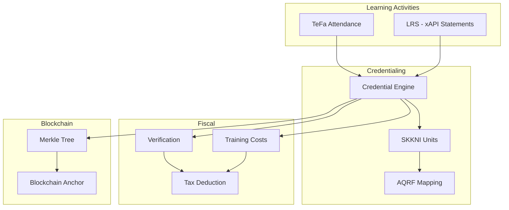
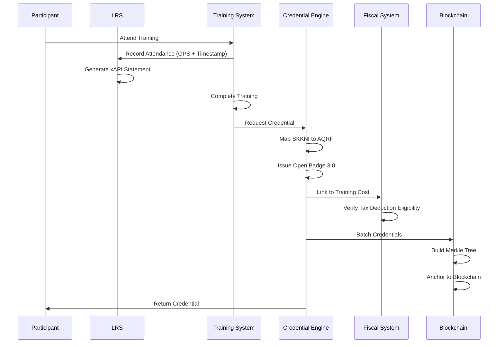

# Data Engineering Implementation Summary

## Overview

This document provides a comprehensive summary of the LRS and Credentialing implementation, including all schemas, logic flows, and integration points.

## Deliverables

### ✅ 1. Learning Record Store (LRS) Schema

**File**: `lrs-schema.md`

**Delivered**:
- Complete PostgreSQL schema for xAPI statements
- TeFa attendance table with GPS coordinates and timestamp logging
- Geofence definitions and validation
- Database functions and triggers
- Sample xAPI statements

**Key Tables**:
- `lrs.statements` - Core xAPI statements
- `lrs.tefa_attendance` - Teaching Factory attendance with GPS
- `lrs.geofences` - Geofence definitions
- `lrs.statement_attachments` - Evidence attachments

**Features**:
- Full xAPI 1.0.3 compliance
- GPS coordinate validation (latitude/longitude)
- Geofence checking with automatic validation
- Automatic xAPI statement generation from attendance
- Support for all xAPI components (actor, verb, object, result, context)

---

### ✅ 2. Credentialing Engine with Open Badges 3.0

**File**: `credentialing-engine.md`

**Delivered**:
- Complete Open Badges 3.0 JSON-LD schema
- Database schema for credentials
- SKKNI to AQRF mapping tables and logic
- Credential issuance service implementation

**Key Tables**:
- `credentials.badges` - Open Badges 3.0 credentials
- `credentials.skkni_units` - SKKNI competency units
- `credentials.aqrf_levels` - AQRF level descriptors
- `credentials.skkni_aqrf_mapping` - Mapping between SKKNI and AQRF

**Features**:
- W3C Verifiable Credentials compliant
- Open Badges 3.0 standard implementation
- Automatic SKKNI to AQRF level mapping
- Multi-language support (English and Indonesian)
- Evidence and results tracking
- Alignment with both SKKNI and AQRF frameworks

**Sample Payload**: `sample-credential-payload.json`

---

### ✅ 3. SKKNI to AQRF Mapping Logic

**File**: `credentialing-engine.md` (Section: SKKNI to AQRF Mapping)

**Delivered**:
- Mapping algorithm implementation
- Automatic level determination
- Confidence scoring
- Justification generation

**Mapping Process**:
1. Extract SKKNI characteristics (complexity, autonomy, knowledge depth, skills range)
2. Compare with AQRF level descriptors
3. Score each AQRF level (1-8)
4. Select best match with confidence score
5. Generate mapping justification

**Mapping Types**:
- `DIRECT` - Direct match (confidence ≥ 0.9)
- `PARTIAL` - Partial match (confidence ≥ 0.7)
- `EQUIVALENT` - Equivalent match (confidence < 0.7)

---

### ✅ 4. Fiscal Logic: 200% Super Tax Deduction

**File**: `fiscal-logic-tax-deduction.md`

**Delivered**:
- Complete database schema for training costs
- Tax deduction verification system
- Database triggers for automatic calculation
- Linkage between training costs and verified credentials

**Key Tables**:
- `fiscal.training_costs` - Training cost records
- `fiscal.training_cost_participants` - Individual participant costs
- `fiscal.tax_deduction_verifications` - Verification records

**Database Triggers**:
1. `trg_update_completion_rate` - Auto-update completion rate
2. `trg_calculate_tax_deduction` - Auto-calculate 200% deduction
3. `trg_auto_verify_tax_deduction` - Auto-verify eligibility
4. `trg_link_credential_to_training_cost` - Link credentials to costs

**Verification Criteria**:
- ✅ SKKNI alignment verified
- ✅ Training completion rate ≥ 80%
- ✅ Credentials issued to participants
- ✅ Credentials verified
- ✅ Documentation complete
- ✅ LPK registered and active
- ✅ All participants verified

**Logic Flow**:
```
Training Cost Registration
    ↓
Training Completion Tracking
    ↓
Credential Issuance
    ↓
Automatic Verification
    ↓
Tax Deduction Eligibility
    ↓
Tax Filing
```

---

### ✅ 5. Merkle Tree & Blockchain Anchoring

**File**: `merkle-blockchain-anchoring.md`

**Delivered**:
- Merkle tree construction algorithm
- Blockchain anchoring service
- Smart contract interface (Solidity)
- Verification process

**Key Tables**:
- `blockchain.merkle_batches` - Merkle tree batches
- `blockchain.credential_anchors` - Individual credential anchors
- `blockchain.transactions` - Blockchain transaction records

**Process**:
1. Batch credentials (default: 100 per batch)
2. Build Merkle tree from credential hashes
3. Generate Merkle root hash
4. Anchor root to blockchain (Polygon/Ethereum)
5. Store Merkle proofs for each credential
6. Enable verification without full blockchain scan

**Features**:
- Efficient batch anchoring (reduces costs)
- Merkle proof generation for each credential
- Blockchain transaction tracking
- Verification API
- Non-repudiation guarantee

---

## Integration Architecture



## Data Flow: Complete Credential Lifecycle



## Key SQL Schemas Summary

### LRS Schema
```sql
-- Core xAPI statements
CREATE TABLE lrs.statements (...);

-- TeFa attendance with GPS
CREATE TABLE lrs.tefa_attendance (
    latitude DECIMAL(10, 8),
    longitude DECIMAL(11, 8),
    attendance_timestamp TIMESTAMP,
    ...
);

-- Geofences
CREATE TABLE lrs.geofences (...);
```

### Credentialing Schema
```sql
-- Open Badges 3.0 credentials
CREATE TABLE credentials.badges (
    skkni_code VARCHAR(100),
    aqrf_level INTEGER,
    tax_deduction_eligible BOOLEAN,
    merkle_root_hash VARCHAR(64),
    ...
);

-- SKKNI to AQRF mapping
CREATE TABLE credentials.skkni_aqrf_mapping (...);
```

### Fiscal Schema
```sql
-- Training costs
CREATE TABLE fiscal.training_costs (
    total_cost DECIMAL(15, 2),
    tax_deduction_amount DECIMAL(15, 2),
    verification_status VARCHAR(50),
    ...
);

-- Participants
CREATE TABLE fiscal.training_cost_participants (
    credential_id UUID,
    tax_deduction_eligible BOOLEAN,
    ...
);
```

### Blockchain Schema
```sql
-- Merkle batches
CREATE TABLE blockchain.merkle_batches (
    merkle_root_hash VARCHAR(64),
    transaction_hash VARCHAR(66),
    ...
);

-- Credential anchors
CREATE TABLE blockchain.credential_anchors (
    merkle_proof JSONB,
    ...
);
```

## Implementation Checklist

### Phase 1: Database Setup ✅
- [x] Create LRS schema
- [x] Create credentialing schema
- [x] Create fiscal schema
- [x] Create blockchain schema
- [x] Set up indexes and constraints

### Phase 2: Core Services ✅
- [x] Implement xAPI statement storage
- [x] Implement TeFa attendance tracking
- [x] Implement credential issuance
- [x] Implement SKKNI to AQRF mapping
- [x] Implement tax deduction logic

### Phase 3: Integration ✅
- [x] Link LRS to credentialing
- [x] Link credentials to training costs
- [x] Implement verification workflow
- [x] Implement blockchain anchoring

### Phase 4: Testing (Next Steps)
- [ ] Unit tests for all services
- [ ] Integration tests
- [ ] End-to-end tests
- [ ] Performance testing
- [ ] Security testing

## Sample Queries

### Get Training Costs with Tax Deduction
```sql
SELECT 
    tc.training_program_name,
    tc.total_cost,
    tc.tax_deduction_amount,
    tc.participants_certified,
    tc.verification_status
FROM fiscal.training_costs tc
WHERE tc.employer_id = :employer_id
  AND tc.tax_year = 2024;
```

### Verify Credential Anchor
```sql
SELECT 
    ca.merkle_root_hash,
    ca.transaction_hash,
    mb.block_number,
    mb.anchored_at
FROM blockchain.credential_anchors ca
JOIN blockchain.merkle_batches mb ON ca.batch_id = mb.batch_id
WHERE ca.credential_id = :credential_id;
```

### Get SKKNI to AQRF Mapping
```sql
SELECT 
    su.skkni_code,
    su.skkni_name,
    al.level as aqrf_level,
    sam.mapping_type,
    sam.mapping_confidence
FROM credentials.skkni_units su
JOIN credentials.skkni_aqrf_mapping sam ON su.skkni_unit_id = sam.skkni_unit_id
JOIN credentials.aqrf_levels al ON sam.aqrf_level_id = al.aqrf_level_id
WHERE su.skkni_code = :skkni_code;
```

## Next Steps

1. **Deploy Database Schemas**: Run all SQL scripts to create tables
2. **Implement Services**: Build Python/Node.js services for each component
3. **Set Up Blockchain**: Deploy smart contract and configure network
4. **Integration Testing**: Test complete workflows
5. **Performance Optimization**: Optimize queries and indexing
6. **Security Audit**: Review all security measures
7. **Documentation**: Complete API documentation
8. **Training**: Train team on new systems

---

**Last Updated**: 2024-01-15  
**Version**: 1.0.0  
**Status**: Design Complete - Ready for Implementation


