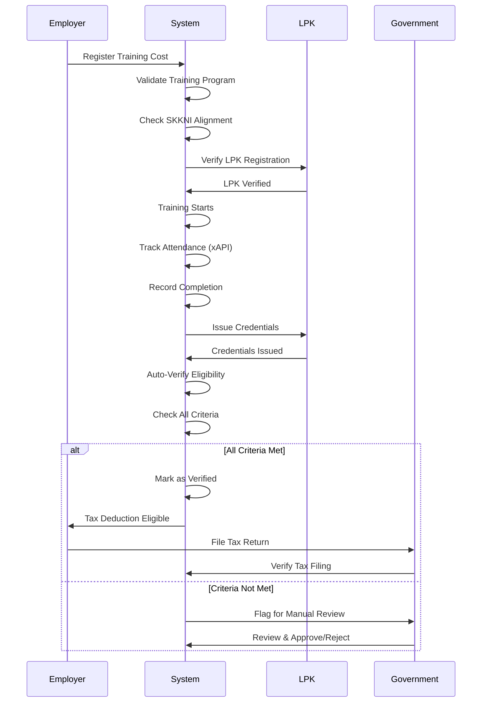

# Fiscal Logic: 200% Super Tax Deduction (MoF 128/2019)

## Overview

This document defines the fiscal logic for the 200% Super Tax Deduction under Ministry of Finance Regulation No. 128/2019 (PMK 128/2019), which provides tax incentives for companies that provide vocational training. The system links training costs to verified credential completion.

## Legal Framework

### PMK 128/2019 Key Provisions

- **Article 1**: Companies can claim 200% tax deduction on vocational training costs
- **Article 2**: Training must be provided to employees or job seekers
- **Article 3**: Training must result in competency certification
- **Article 4**: Training costs must be properly documented
- **Article 5**: Certification must be verified and recognized

### Requirements for Tax Deduction

1. **Training Provider**: Must be registered LPK (Lembaga Pelatihan Kerja)
2. **Training Program**: Must align with SKKNI standards
3. **Certification**: Must issue verifiable credentials
4. **Verification**: Training completion must be verified
5. **Documentation**: All costs must be properly documented

## Database Schema

### 1. Training Costs Table

```sql
-- Training costs for tax deduction
CREATE TABLE fiscal.training_costs (
    training_cost_id UUID PRIMARY KEY DEFAULT gen_random_uuid(),
    
    -- Training program reference
    training_program_id UUID NOT NULL,
    training_program_name VARCHAR(255) NOT NULL,
    training_program_code VARCHAR(100),
    
    -- Employer/Company (taxpayer)
    employer_id UUID NOT NULL REFERENCES system.tenants(tenant_id),
    employer_name VARCHAR(255) NOT NULL,
    employer_tax_id VARCHAR(50) NOT NULL, -- NPWP
    employer_address TEXT,
    
    -- Training provider (LPK)
    lpk_id UUID NOT NULL REFERENCES system.tenants(tenant_id),
    lpk_name VARCHAR(255) NOT NULL,
    lpk_registration_number VARCHAR(100) NOT NULL,
    lpk_tax_id VARCHAR(50),
    
    -- Training details
    training_start_date DATE NOT NULL,
    training_end_date DATE NOT NULL,
    training_duration_days INTEGER NOT NULL,
    training_hours INTEGER NOT NULL,
    
    -- Cost breakdown
    total_cost DECIMAL(15, 2) NOT NULL,
    instructor_fees DECIMAL(15, 2) DEFAULT 0,
    facility_rental DECIMAL(15, 2) DEFAULT 0,
    materials_cost DECIMAL(15, 2) DEFAULT 0,
    equipment_cost DECIMAL(15, 2) DEFAULT 0,
    certification_fee DECIMAL(15, 2) DEFAULT 0,
    other_costs DECIMAL(15, 2) DEFAULT 0,
    cost_breakdown JSONB, -- Detailed breakdown
    
    -- Participants
    participant_count INTEGER NOT NULL,
    participant_list JSONB, -- Array of participant IDs
    
    -- SKKNI alignment
    skkni_code VARCHAR(100),
    skkni_name VARCHAR(255),
    skkni_alignment_verified BOOLEAN DEFAULT FALSE,
    skkni_verified_by UUID,
    skkni_verified_at TIMESTAMP,
    
    -- Tax deduction eligibility
    tax_deduction_eligible BOOLEAN DEFAULT FALSE,
    tax_deduction_percentage DECIMAL(5, 2) DEFAULT 200.00, -- 200% for PMK 128/2019
    tax_deduction_amount DECIMAL(15, 2), -- Calculated: total_cost * 2.0
    
    -- Verification status
    verification_status VARCHAR(50) DEFAULT 'PENDING' CHECK (
        verification_status IN ('PENDING', 'IN_PROGRESS', 'VERIFIED', 'REJECTED', 'EXPIRED')
    ),
    verification_started_at TIMESTAMP,
    verification_completed_at TIMESTAMP,
    verified_by UUID, -- Government officer or system
    verification_notes TEXT,
    
    -- Completion tracking
    participants_completed INTEGER DEFAULT 0,
    participants_certified INTEGER DEFAULT 0,
    completion_rate DECIMAL(5, 2), -- Percentage
    
    -- Documentation
    invoice_url VARCHAR(500),
    receipt_url VARCHAR(500),
    contract_url VARCHAR(500),
    training_plan_url VARCHAR(500),
    attendance_records_url VARCHAR(500),
    documentation_complete BOOLEAN DEFAULT FALSE,
    
    -- Tax filing
    tax_year INTEGER NOT NULL, -- Fiscal year
    tax_period VARCHAR(20), -- e.g., "2024-Q1"
    tax_filing_status VARCHAR(50) DEFAULT 'NOT_FILED' CHECK (
        tax_filing_status IN ('NOT_FILED', 'FILED', 'APPROVED', 'REJECTED', 'AUDITED')
    ),
    tax_filing_reference VARCHAR(100), -- Reference number from tax filing
    tax_filed_at TIMESTAMP,
    tax_approved_at TIMESTAMP,
    
    -- Audit trail
    created_by UUID,
    created_at TIMESTAMP DEFAULT CURRENT_TIMESTAMP,
    updated_at TIMESTAMP DEFAULT CURRENT_TIMESTAMP,
    
    CONSTRAINT chk_cost_breakdown CHECK (
        total_cost = (
            COALESCE(instructor_fees, 0) +
            COALESCE(facility_rental, 0) +
            COALESCE(materials_cost, 0) +
            COALESCE(equipment_cost, 0) +
            COALESCE(certification_fee, 0) +
            COALESCE(other_costs, 0)
        )
    ),
    CONSTRAINT chk_dates CHECK (training_end_date >= training_start_date),
    CONSTRAINT chk_participants CHECK (participant_count > 0)
);

-- Indexes
CREATE INDEX idx_training_costs_employer ON fiscal.training_costs(employer_id, tax_year);
CREATE INDEX idx_training_costs_lpk ON fiscal.training_costs(lpk_id, tax_year);
CREATE INDEX idx_training_costs_status ON fiscal.training_costs(verification_status);
CREATE INDEX idx_training_costs_tax_year ON fiscal.training_costs(tax_year, tax_filing_status);
CREATE INDEX idx_training_costs_skkni ON fiscal.training_costs(skkni_code);
```

### 2. Training Cost Participants Table

```sql
-- Individual participant training costs
CREATE TABLE fiscal.training_cost_participants (
    participant_cost_id UUID PRIMARY KEY DEFAULT gen_random_uuid(),
    training_cost_id UUID NOT NULL REFERENCES fiscal.training_costs(training_cost_id) ON DELETE CASCADE,
    
    -- Participant
    participant_id VARCHAR(50) NOT NULL, -- NIK or identifier
    participant_name VARCHAR(255) NOT NULL,
    participant_type VARCHAR(50) NOT NULL CHECK (participant_type IN ('EMPLOYEE', 'JOB_SEEKER')),
    
    -- Cost allocation
    allocated_cost DECIMAL(15, 2) NOT NULL, -- Cost allocated to this participant
    
    -- Completion status
    training_completed BOOLEAN DEFAULT FALSE,
    training_completed_at TIMESTAMP,
    completion_verified BOOLEAN DEFAULT FALSE,
    completion_verified_at TIMESTAMP,
    
    -- Certification
    credential_id UUID REFERENCES credentials.badges(badge_id),
    credential_issued BOOLEAN DEFAULT FALSE,
    credential_issued_at TIMESTAMP,
    credential_verified BOOLEAN DEFAULT FALSE,
    credential_verified_at TIMESTAMP,
    
    -- Tax deduction eligibility for this participant
    tax_deduction_eligible BOOLEAN DEFAULT FALSE,
    tax_deduction_amount DECIMAL(15, 2), -- allocated_cost * 2.0
    
    -- Metadata
    created_at TIMESTAMP DEFAULT CURRENT_TIMESTAMP,
    updated_at TIMESTAMP DEFAULT CURRENT_TIMESTAMP,
    
    UNIQUE(training_cost_id, participant_id)
);

CREATE INDEX idx_participant_costs_training ON fiscal.training_cost_participants(training_cost_id);
CREATE INDEX idx_participant_costs_participant ON fiscal.training_cost_participants(participant_id);
CREATE INDEX idx_participant_costs_completion ON fiscal.training_cost_participants(training_completed, completion_verified);
CREATE INDEX idx_participant_costs_credential ON fiscal.training_cost_participants(credential_id);
```

### 3. Tax Deduction Verification Table

```sql
-- Tax deduction verification records
CREATE TABLE fiscal.tax_deduction_verifications (
    verification_id UUID PRIMARY KEY DEFAULT gen_random_uuid(),
    training_cost_id UUID NOT NULL REFERENCES fiscal.training_costs(training_cost_id),
    
    -- Verification details
    verification_type VARCHAR(50) NOT NULL CHECK (
        verification_type IN ('AUTOMATIC', 'MANUAL', 'AUDIT')
    ),
    verification_status VARCHAR(50) DEFAULT 'PENDING' CHECK (
        verification_status IN ('PENDING', 'IN_PROGRESS', 'APPROVED', 'REJECTED')
    ),
    
    -- Verification criteria
    criteria_skkni_aligned BOOLEAN,
    criteria_training_completed BOOLEAN,
    criteria_credentials_issued BOOLEAN,
    criteria_credentials_verified BOOLEAN,
    criteria_documentation_complete BOOLEAN,
    criteria_lpk_registered BOOLEAN,
    criteria_participants_verified BOOLEAN,
    
    -- Verification results
    all_criteria_met BOOLEAN DEFAULT FALSE,
    verification_score DECIMAL(5, 2), -- 0-100
    verification_notes TEXT,
    
    -- Verifier
    verified_by UUID, -- Government officer or system user
    verified_at TIMESTAMP,
    verification_method VARCHAR(50), -- 'SYSTEM', 'MANUAL_REVIEW', 'AUDIT'
    
    -- Approval
    approved_by UUID,
    approved_at TIMESTAMP,
    approval_notes TEXT,
    
    -- Rejection
    rejected_reason TEXT,
    rejected_by UUID,
    rejected_at TIMESTAMP,
    
    -- Metadata
    created_at TIMESTAMP DEFAULT CURRENT_TIMESTAMP,
    updated_at TIMESTAMP DEFAULT CURRENT_TIMESTAMP
);

CREATE INDEX idx_verifications_training_cost ON fiscal.tax_deduction_verifications(training_cost_id);
CREATE INDEX idx_verifications_status ON fiscal.tax_deduction_verifications(verification_status);
CREATE INDEX idx_verifications_verified_by ON fiscal.tax_deduction_verifications(verified_by);
```

## Database Triggers

### 1. Trigger: Update Completion Rate

```sql
CREATE OR REPLACE FUNCTION fiscal.update_training_completion_rate()
RETURNS TRIGGER AS $$
DECLARE
    v_total_participants INTEGER;
    v_completed_participants INTEGER;
    v_certified_participants INTEGER;
    v_completion_rate DECIMAL(5, 2);
BEGIN
    -- Get training cost record
    SELECT 
        participant_count,
        participants_completed,
        participants_certified
    INTO 
        v_total_participants,
        v_completed_participants,
        v_certified_participants
    FROM fiscal.training_costs
    WHERE training_cost_id = COALESCE(NEW.training_cost_id, OLD.training_cost_id);
    
    -- Calculate completion rate
    IF v_total_participants > 0 THEN
        v_completion_rate := (v_completed_participants::DECIMAL / v_total_participants) * 100;
    ELSE
        v_completion_rate := 0;
    END IF;
    
    -- Update training cost record
    UPDATE fiscal.training_costs
    SET 
        participants_completed = v_completed_participants,
        participants_certified = v_certified_participants,
        completion_rate = v_completion_rate,
        updated_at = CURRENT_TIMESTAMP
    WHERE training_cost_id = COALESCE(NEW.training_cost_id, OLD.training_cost_id);
    
    RETURN COALESCE(NEW, OLD);
END;
$$ LANGUAGE plpgsql;

CREATE TRIGGER trg_update_completion_rate
    AFTER INSERT OR UPDATE OF training_completed, credential_issued
    ON fiscal.training_cost_participants
    FOR EACH ROW
    EXECUTE FUNCTION fiscal.update_training_completion_rate();
```

### 2. Trigger: Calculate Tax Deduction Amount

```sql
CREATE OR REPLACE FUNCTION fiscal.calculate_tax_deduction()
RETURNS TRIGGER AS $$
BEGIN
    -- Calculate tax deduction amount (200% of cost)
    NEW.tax_deduction_amount := NEW.total_cost * (NEW.tax_deduction_percentage / 100.0);
    
    RETURN NEW;
END;
$$ LANGUAGE plpgsql;

CREATE TRIGGER trg_calculate_tax_deduction
    BEFORE INSERT OR UPDATE OF total_cost, tax_deduction_percentage
    ON fiscal.training_costs
    FOR EACH ROW
    EXECUTE FUNCTION fiscal.calculate_tax_deduction();
```

### 3. Trigger: Auto-Verify Tax Deduction Eligibility

```sql
CREATE OR REPLACE FUNCTION fiscal.auto_verify_tax_deduction()
RETURNS TRIGGER AS $$
DECLARE
    v_all_criteria_met BOOLEAN := TRUE;
    v_skkni_aligned BOOLEAN;
    v_completion_rate DECIMAL(5, 2);
    v_credentials_issued BOOLEAN;
    v_documentation_complete BOOLEAN;
    v_lpk_registered BOOLEAN;
BEGIN
    -- Check all verification criteria
    SELECT 
        skkni_alignment_verified,
        completion_rate,
        participants_certified > 0,
        documentation_complete,
        EXISTS (
            SELECT 1 FROM system.tenants t
            WHERE t.tenant_id = NEW.lpk_id
            AND t.tenant_type = 'LPK'
            AND t.status = 'ACTIVE'
        )
    INTO 
        v_skkni_aligned,
        v_completion_rate,
        v_credentials_issued,
        v_documentation_complete,
        v_lpk_registered
    FROM fiscal.training_costs
    WHERE training_cost_id = NEW.training_cost_id;
    
    -- All criteria must be met
    v_all_criteria_met := 
        v_skkni_aligned = TRUE AND
        v_completion_rate >= 80.0 AND -- At least 80% completion
        v_credentials_issued = TRUE AND
        v_documentation_complete = TRUE AND
        v_lpk_registered = TRUE;
    
    -- Update eligibility
    IF v_all_criteria_met THEN
        NEW.tax_deduction_eligible := TRUE;
        NEW.verification_status := 'VERIFIED';
        NEW.verification_completed_at := CURRENT_TIMESTAMP;
    ELSE
        NEW.tax_deduction_eligible := FALSE;
        IF NEW.verification_status = 'PENDING' THEN
            NEW.verification_status := 'IN_PROGRESS';
        END IF;
    END IF;
    
    RETURN NEW;
END;
$$ LANGUAGE plpgsql;

CREATE TRIGGER trg_auto_verify_tax_deduction
    AFTER INSERT OR UPDATE OF 
        skkni_alignment_verified,
        participants_certified,
        documentation_complete
    ON fiscal.training_costs
    FOR EACH ROW
    EXECUTE FUNCTION fiscal.auto_verify_tax_deduction();
```

### 4. Trigger: Link Credential to Training Cost

```sql
CREATE OR REPLACE FUNCTION fiscal.link_credential_to_training_cost()
RETURNS TRIGGER AS $$
DECLARE
    v_training_cost_id UUID;
    v_participant_id VARCHAR(50);
BEGIN
    -- Extract participant ID from credential
    v_participant_id := NEW.credential_json->'credentialSubject'->>'id';
    
    -- Find matching training cost participant
    SELECT tcp.training_cost_id
    INTO v_training_cost_id
    FROM fiscal.training_cost_participants tcp
    WHERE tcp.participant_id = v_participant_id
      AND tcp.training_completed = TRUE
      AND tcp.credential_id IS NULL
    ORDER BY tcp.created_at DESC
    LIMIT 1;
    
    -- Link credential to training cost
    IF v_training_cost_id IS NOT NULL THEN
        UPDATE fiscal.training_cost_participants
        SET 
            credential_id = NEW.badge_id,
            credential_issued = TRUE,
            credential_issued_at = NEW.issuance_date,
            credential_verified = TRUE,
            credential_verified_at = CURRENT_TIMESTAMP,
            tax_deduction_eligible = TRUE,
            tax_deduction_amount = allocated_cost * 2.0
        WHERE training_cost_id = v_training_cost_id
          AND participant_id = v_participant_id;
        
        -- Update training cost
        UPDATE fiscal.training_costs
        SET 
            participants_certified = participants_certified + 1,
            updated_at = CURRENT_TIMESTAMP
        WHERE training_cost_id = v_training_cost_id;
        
        -- Update credential record
        UPDATE credentials.badges
        SET 
            training_cost_id = v_training_cost_id,
            tax_deduction_eligible = TRUE,
            tax_deduction_verified = TRUE,
            tax_deduction_verified_at = CURRENT_TIMESTAMP
        WHERE badge_id = NEW.badge_id;
    END IF;
    
    RETURN NEW;
END;
$$ LANGUAGE plpgsql;

CREATE TRIGGER trg_link_credential_to_training_cost
    AFTER INSERT ON credentials.badges
    FOR EACH ROW
    WHEN (NEW.status = 'ACTIVE')
    EXECUTE FUNCTION fiscal.link_credential_to_training_cost();
```

## Verification Logic Flow



## Verification Process Implementation

```python
class TaxDeductionVerificationService:
    """Verify tax deduction eligibility"""
    
    async def verify_training_cost(
        self,
        training_cost_id: UUID
    ) -> dict:
        """Verify training cost for tax deduction"""
        
        # Get training cost
        training_cost = await self.get_training_cost(training_cost_id)
        
        # Create verification record
        verification = await self.create_verification(training_cost_id)
        
        # Check all criteria
        criteria_results = await self.check_all_criteria(training_cost)
        
        # Update verification
        all_met = all(criteria_results.values())
        
        verification.update({
            'criteria_skkni_aligned': criteria_results['skkni_aligned'],
            'criteria_training_completed': criteria_results['training_completed'],
            'criteria_credentials_issued': criteria_results['credentials_issued'],
            'criteria_credentials_verified': criteria_results['credentials_verified'],
            'criteria_documentation_complete': criteria_results['documentation_complete'],
            'criteria_lpk_registered': criteria_results['lpk_registered'],
            'criteria_participants_verified': criteria_results['participants_verified'],
            'all_criteria_met': all_met,
            'verification_score': self.calculate_score(criteria_results)
        })
        
        if all_met:
            verification['verification_status'] = 'APPROVED'
            verification['verified_at'] = datetime.now()
            
            # Update training cost
            await self.update_training_cost(training_cost_id, {
                'tax_deduction_eligible': True,
                'verification_status': 'VERIFIED',
                'verification_completed_at': datetime.now()
            })
        else:
            verification['verification_status'] = 'REJECTED'
            verification['rejected_reason'] = self.generate_rejection_reason(criteria_results)
        
        await self.save_verification(verification)
        
        return verification
    
    async def check_all_criteria(self, training_cost: dict) -> dict:
        """Check all verification criteria"""
        
        return {
            'skkni_aligned': await self.check_skkni_alignment(training_cost),
            'training_completed': await self.check_training_completion(training_cost),
            'credentials_issued': await self.check_credentials_issued(training_cost),
            'credentials_verified': await self.check_credentials_verified(training_cost),
            'documentation_complete': await self.check_documentation(training_cost),
            'lpk_registered': await self.check_lpk_registration(training_cost),
            'participants_verified': await self.check_participants_verified(training_cost)
        }
    
    async def check_skkni_alignment(self, training_cost: dict) -> bool:
        """Check if training aligns with SKKNI"""
        return training_cost.get('skkni_alignment_verified', False)
    
    async def check_training_completion(self, training_cost: dict) -> bool:
        """Check if training is completed"""
        completion_rate = training_cost.get('completion_rate', 0)
        return completion_rate >= 80.0  # At least 80% completion
    
    async def check_credentials_issued(self, training_cost: dict) -> bool:
        """Check if credentials are issued"""
        return training_cost.get('participants_certified', 0) > 0
    
    async def check_credentials_verified(self, training_cost: dict) -> bool:
        """Check if credentials are verified"""
        # Get all participants
        participants = await self.get_training_participants(training_cost['training_cost_id'])
        
        # Check if all participants with credentials have verified credentials
        for participant in participants:
            if participant.get('credential_issued'):
                if not participant.get('credential_verified'):
                    return False
        
        return True
    
    async def check_documentation(self, training_cost: dict) -> bool:
        """Check if documentation is complete"""
        return training_cost.get('documentation_complete', False)
    
    async def check_lpk_registration(self, training_cost: dict) -> bool:
        """Check if LPK is registered"""
        lpk = await self.get_tenant(training_cost['lpk_id'])
        return (
            lpk.get('tenant_type') == 'LPK' and
            lpk.get('status') == 'ACTIVE' and
            lpk.get('registration_number') is not None
        )
    
    async def check_participants_verified(self, training_cost: dict) -> bool:
        """Check if participants are verified"""
        # All participants must have completed training and have verified credentials
        participants = await self.get_training_participants(training_cost['training_cost_id'])
        
        for participant in participants:
            if not participant.get('training_completed'):
                return False
            if not participant.get('credential_verified'):
                return False
        
        return True
```

## Sample Queries

### Get Tax Deduction Summary for Employer

```sql
SELECT 
    tc.tax_year,
    COUNT(*) as total_trainings,
    SUM(tc.total_cost) as total_training_cost,
    SUM(tc.tax_deduction_amount) as total_tax_deduction,
    SUM(tc.participants_certified) as total_certified_participants,
    COUNT(CASE WHEN tc.tax_deduction_eligible THEN 1 END) as eligible_trainings
FROM fiscal.training_costs tc
WHERE tc.employer_id = :employer_id
  AND tc.tax_year = :tax_year
GROUP BY tc.tax_year;
```

### Get Training Costs Pending Verification

```sql
SELECT 
    tc.training_cost_id,
    tc.training_program_name,
    tc.total_cost,
    tc.completion_rate,
    tc.participants_certified,
    tc.skkni_alignment_verified,
    tc.documentation_complete,
    tc.verification_status
FROM fiscal.training_costs tc
WHERE tc.verification_status IN ('PENDING', 'IN_PROGRESS')
  AND tc.tax_year = :tax_year
ORDER BY tc.created_at DESC;
```

---

**Last Updated**: 2024-01-15  
**Version**: 1.0.0


