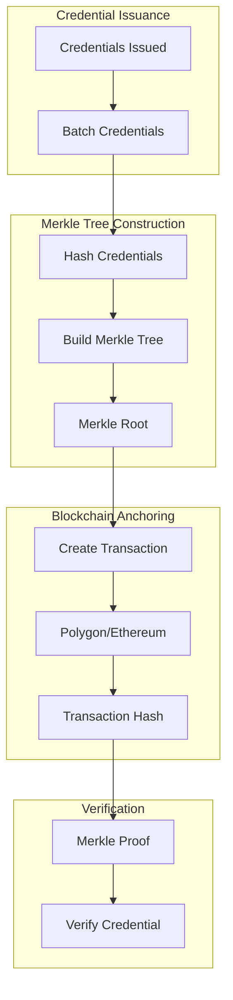

# Merkle Tree & Blockchain Anchoring Strategy

## Overview

This document defines the Merkle Tree and Blockchain anchoring strategy for credential non-repudiation, ensuring that issued credentials cannot be denied or tampered with after issuance.

## Strategy Overview

### Two-Layer Approach

1. **Merkle Tree**: Batch credentials into Merkle trees for efficient verification
2. **Blockchain Anchoring**: Anchor Merkle roots to public blockchains for immutable proof

### Benefits

- **Non-Repudiation**: Cryptographic proof that credentials were issued
- **Tamper Detection**: Any modification to credentials can be detected
- **Efficient Verification**: Merkle proofs allow verification without full blockchain scan
- **Cost Effective**: Batch anchoring reduces blockchain transaction costs
- **Scalable**: Can handle high-volume credential issuance

## Architecture



## Database Schema

### 1. Merkle Tree Batches Table

```sql
-- Merkle tree batches for credential anchoring
CREATE TABLE blockchain.merkle_batches (
    batch_id UUID PRIMARY KEY DEFAULT gen_random_uuid(),
    
    -- Batch identification
    batch_number BIGSERIAL, -- Sequential batch number
    batch_date DATE NOT NULL DEFAULT CURRENT_DATE,
    
    -- Merkle tree
    merkle_root_hash VARCHAR(64) NOT NULL UNIQUE, -- SHA-256 hash of root
    merkle_tree_depth INTEGER NOT NULL, -- Depth of the tree
    merkle_tree_leaves INTEGER NOT NULL, -- Number of leaves (credentials)
    merkle_tree_json JSONB, -- Full tree structure (for verification)
    
    -- Credentials in batch
    credential_ids UUID[] NOT NULL, -- Array of credential IDs
    credential_count INTEGER NOT NULL,
    
    -- Blockchain anchoring
    blockchain_network VARCHAR(50) NOT NULL DEFAULT 'POLYGON' CHECK (
        blockchain_network IN ('POLYGON', 'ETHEREUM', 'BSC', 'AVALANCHE')
    ),
    blockchain_chain_id INTEGER, -- Chain ID (e.g., 137 for Polygon Mainnet)
    transaction_hash VARCHAR(66), -- Blockchain transaction hash
    transaction_status VARCHAR(50) DEFAULT 'PENDING' CHECK (
        transaction_status IN ('PENDING', 'SUBMITTED', 'CONFIRMED', 'FAILED')
    ),
    block_number BIGINT, -- Block number where transaction was included
    block_timestamp TIMESTAMP, -- Block timestamp
    gas_used BIGINT, -- Gas used for transaction
    gas_price BIGINT, -- Gas price (in wei/gwei)
    transaction_fee DECIMAL(20, 8), -- Transaction fee in native token
    
    -- Smart contract
    contract_address VARCHAR(42), -- Smart contract address
    contract_method VARCHAR(100), -- Method called (e.g., 'anchorMerkleRoot')
    
    -- Anchoring metadata
    anchored_at TIMESTAMP, -- When anchored to blockchain
    anchoring_duration_seconds INTEGER, -- Time taken to anchor
    
    -- Verification
    verification_count INTEGER DEFAULT 0, -- Number of times verified
    last_verified_at TIMESTAMP,
    
    -- Status
    status VARCHAR(50) DEFAULT 'PENDING' CHECK (
        status IN ('PENDING', 'BUILDING', 'READY', 'ANCHORING', 'ANCHORED', 'FAILED')
    ),
    
    -- Metadata
    created_by UUID,
    created_at TIMESTAMP DEFAULT CURRENT_TIMESTAMP,
    updated_at TIMESTAMP DEFAULT CURRENT_TIMESTAMP
);

-- Indexes
CREATE INDEX idx_merkle_batches_root ON blockchain.merkle_batches(merkle_root_hash);
CREATE INDEX idx_merkle_batches_tx_hash ON blockchain.merkle_batches(transaction_hash);
CREATE INDEX idx_merkle_batches_status ON blockchain.merkle_batches(status, batch_date);
CREATE INDEX idx_merkle_batches_date ON blockchain.merkle_batches(batch_date);
```

### 2. Credential Anchoring Table

```sql
-- Individual credential anchoring records
CREATE TABLE blockchain.credential_anchors (
    anchor_id UUID PRIMARY KEY DEFAULT gen_random_uuid(),
    
    -- Credential reference
    credential_id UUID NOT NULL REFERENCES credentials.badges(badge_id),
    badge_id UUID NOT NULL,
    
    -- Merkle tree reference
    batch_id UUID NOT NULL REFERENCES blockchain.merkle_batches(batch_id),
    merkle_root_hash VARCHAR(64) NOT NULL,
    
    -- Merkle proof
    merkle_proof JSONB NOT NULL, -- Array of hashes for Merkle proof
    merkle_proof_path TEXT[], -- Path in tree (left/right indicators)
    leaf_index INTEGER NOT NULL, -- Index of credential in batch
    leaf_hash VARCHAR(64) NOT NULL, -- Hash of credential
    
    -- Blockchain reference
    transaction_hash VARCHAR(66),
    block_number BIGINT,
    blockchain_network VARCHAR(50),
    
    -- Verification
    verified BOOLEAN DEFAULT FALSE,
    verified_at TIMESTAMP,
    verification_count INTEGER DEFAULT 0,
    
    -- Metadata
    created_at TIMESTAMP DEFAULT CURRENT_TIMESTAMP,
    updated_at TIMESTAMP DEFAULT CURRENT_TIMESTAMP,
    
    UNIQUE(credential_id, batch_id)
);

-- Indexes
CREATE INDEX idx_anchors_credential ON blockchain.credential_anchors(credential_id);
CREATE INDEX idx_anchors_batch ON blockchain.credential_anchors(batch_id);
CREATE INDEX idx_anchors_root ON blockchain.credential_anchors(merkle_root_hash);
CREATE INDEX idx_anchors_tx_hash ON blockchain.credential_anchors(transaction_hash);
```

### 3. Blockchain Transactions Table

```sql
-- Blockchain transaction records
CREATE TABLE blockchain.transactions (
    transaction_id UUID PRIMARY KEY DEFAULT gen_random_uuid(),
    
    -- Transaction details
    transaction_hash VARCHAR(66) UNIQUE NOT NULL,
    blockchain_network VARCHAR(50) NOT NULL,
    chain_id INTEGER NOT NULL,
    
    -- Transaction status
    status VARCHAR(50) DEFAULT 'PENDING' CHECK (
        status IN ('PENDING', 'SUBMITTED', 'CONFIRMED', 'FAILED', 'REVERTED')
    ),
    
    -- Block information
    block_number BIGINT,
    block_hash VARCHAR(66),
    block_timestamp TIMESTAMP,
    confirmations INTEGER DEFAULT 0,
    
    -- Transaction details
    from_address VARCHAR(42) NOT NULL, -- Sender address
    to_address VARCHAR(42), -- Recipient address (contract)
    value DECIMAL(20, 8) DEFAULT 0, -- Value in native token
    gas_limit BIGINT,
    gas_used BIGINT,
    gas_price BIGINT,
    transaction_fee DECIMAL(20, 8),
    
    -- Smart contract interaction
    contract_address VARCHAR(42),
    function_name VARCHAR(100),
    function_args JSONB,
    
    -- Error information
    error_message TEXT,
    revert_reason TEXT,
    
    -- Metadata
    submitted_at TIMESTAMP,
    confirmed_at TIMESTAMP,
    created_at TIMESTAMP DEFAULT CURRENT_TIMESTAMP,
    updated_at TIMESTAMP DEFAULT CURRENT_TIMESTAMP
);

CREATE INDEX idx_transactions_hash ON blockchain.transactions(transaction_hash);
CREATE INDEX idx_transactions_status ON blockchain.transactions(status, blockchain_network);
CREATE INDEX idx_transactions_block ON blockchain.transactions(block_number, blockchain_network);
```

## Merkle Tree Implementation

### Python Implementation

```python
import hashlib
import json
from typing import List, Dict, Optional
from dataclasses import dataclass

@dataclass
class MerkleNode:
    """Merkle tree node"""
    hash: str
    left: Optional['MerkleNode'] = None
    right: Optional['MerkleNode'] = None
    data: Optional[Dict] = None  # For leaf nodes

class MerkleTreeBuilder:
    """Build Merkle tree from credentials"""
    
    def __init__(self):
        self.leaves: List[MerkleNode] = []
        self.root: Optional[MerkleNode] = None
    
    def hash_data(self, data: str) -> str:
        """Hash data using SHA-256"""
        return hashlib.sha256(data.encode('utf-8')).hexdigest()
    
    def hash_credential(self, credential: Dict) -> str:
        """Hash credential for Merkle tree"""
        # Create canonical JSON representation
        credential_str = json.dumps(
            credential,
            sort_keys=True,
            separators=(',', ':')
        )
        return self.hash_data(credential_str)
    
    def add_credential(self, credential: Dict, credential_id: str) -> str:
        """Add credential to Merkle tree"""
        # Hash credential
        leaf_hash = self.hash_credential(credential)
        
        # Create leaf node
        leaf = MerkleNode(
            hash=leaf_hash,
            data={
                'credential_id': credential_id,
                'credential': credential
            }
        )
        
        self.leaves.append(leaf)
        return leaf_hash
    
    def build_tree(self) -> str:
        """Build Merkle tree and return root hash"""
        if not self.leaves:
            raise ValueError("No credentials added to tree")
        
        # Build tree bottom-up
        current_level = self.leaves.copy()
        
        while len(current_level) > 1:
            next_level = []
            
            # Process pairs
            for i in range(0, len(current_level), 2):
                left = current_level[i]
                right = current_level[i + 1] if i + 1 < len(current_level) else left
                
                # Combine hashes
                combined = left.hash + right.hash
                parent_hash = self.hash_data(combined)
                
                # Create parent node
                parent = MerkleNode(
                    hash=parent_hash,
                    left=left,
                    right=right
                )
                
                next_level.append(parent)
            
            current_level = next_level
        
        self.root = current_level[0]
        return self.root.hash
    
    def get_merkle_proof(self, credential_id: str) -> Dict:
        """Get Merkle proof for a credential"""
        # Find leaf node
        leaf_index = None
        for i, leaf in enumerate(self.leaves):
            if leaf.data and leaf.data.get('credential_id') == credential_id:
                leaf_index = i
                break
        
        if leaf_index is None:
            raise ValueError(f"Credential not found: {credential_id}")
        
        # Build proof path
        proof = []
        path = []
        current_index = leaf_index
        current_level = self.leaves.copy()
        
        while len(current_level) > 1:
            # Determine if current node is left or right
            is_left = (current_index % 2) == 0
            sibling_index = current_index + 1 if is_left else current_index - 1
            
            # Get sibling hash
            if sibling_index < len(current_level):
                sibling_hash = current_level[sibling_index].hash
                proof.append(sibling_hash)
                path.append('right' if is_left else 'left')
            else:
                # Odd number of nodes, duplicate last node
                proof.append(current_level[current_index].hash)
                path.append('right' if is_left else 'left')
            
            # Move to next level
            current_index = current_index // 2
            next_level = []
            for i in range(0, len(current_level), 2):
                left = current_level[i]
                right = current_level[i + 1] if i + 1 < len(current_level) else left
                combined = left.hash + right.hash
                parent_hash = self.hash_data(combined)
                next_level.append(MerkleNode(hash=parent_hash))
            current_level = next_level
        
        return {
            'merkle_proof': proof,
            'merkle_path': path,
            'leaf_index': leaf_index,
            'leaf_hash': self.leaves[leaf_index].hash,
            'root_hash': self.root.hash
        }
    
    def verify_proof(
        self,
        leaf_hash: str,
        merkle_proof: List[str],
        merkle_path: List[str],
        root_hash: str
    ) -> bool:
        """Verify Merkle proof"""
        current_hash = leaf_hash
        
        for i, sibling_hash in enumerate(merkle_proof):
            direction = merkle_path[i] if i < len(merkle_path) else 'right'
            
            if direction == 'left':
                # Current is right, sibling is left
                combined = sibling_hash + current_hash
            else:
                # Current is left, sibling is right
                combined = current_hash + sibling_hash
            
            current_hash = self.hash_data(combined)
        
        return current_hash == root_hash
```

## Blockchain Anchoring

### Smart Contract Interface

```solidity
// SPDX-License-Identifier: MIT
pragma solidity ^0.8.19;

/**
 * @title CredentialAnchoring
 * @dev Smart contract for anchoring Merkle roots of credentials
 */
contract CredentialAnchoring {
    struct MerkleRoot {
        bytes32 rootHash;
        uint256 timestamp;
        uint256 credentialCount;
        address anchoredBy;
    }
    
    // Mapping from Merkle root to anchor record
    mapping(bytes32 => MerkleRoot) public merkleRoots;
    
    // Array of all anchored roots
    bytes32[] public anchoredRoots;
    
    // Events
    event MerkleRootAnchored(
        bytes32 indexed rootHash,
        uint256 timestamp,
        uint256 credentialCount,
        address indexed anchoredBy
    );
    
    /**
     * @dev Anchor a Merkle root
     * @param rootHash The Merkle root hash to anchor
     * @param credentialCount Number of credentials in the batch
     */
    function anchorMerkleRoot(
        bytes32 rootHash,
        uint256 credentialCount
    ) external {
        require(
            merkleRoots[rootHash].timestamp == 0,
            "Merkle root already anchored"
        );
        
        merkleRoots[rootHash] = MerkleRoot({
            rootHash: rootHash,
            timestamp: block.timestamp,
            credentialCount: credentialCount,
            anchoredBy: msg.sender
        });
        
        anchoredRoots.push(rootHash);
        
        emit MerkleRootAnchored(
            rootHash,
            block.timestamp,
            credentialCount,
            msg.sender
        );
    }
    
    /**
     * @dev Verify if a Merkle root is anchored
     * @param rootHash The Merkle root hash to verify
     * @return bool True if anchored, false otherwise
     */
    function isAnchored(bytes32 rootHash) external view returns (bool) {
        return merkleRoots[rootHash].timestamp > 0;
    }
    
    /**
     * @dev Get anchor information for a Merkle root
     * @param rootHash The Merkle root hash
     * @return timestamp When the root was anchored
     * @return credentialCount Number of credentials in the batch
     * @return anchoredBy Address that anchored the root
     */
    function getAnchorInfo(bytes32 rootHash)
        external
        view
        returns (
            uint256 timestamp,
            uint256 credentialCount,
            address anchoredBy
        )
    {
        MerkleRoot memory root = merkleRoots[rootHash];
        require(root.timestamp > 0, "Merkle root not anchored");
        
        return (root.timestamp, root.credentialCount, root.anchoredBy);
    }
    
    /**
     * @dev Get total number of anchored roots
     * @return uint256 Total number of anchored roots
     */
    function getAnchoredRootCount() external view returns (uint256) {
        return anchoredRoots.length;
    }
}
```

### Blockchain Anchoring Service

```python
from web3 import Web3
from typing import Dict, Optional
import json

class BlockchainAnchoringService:
    """Service for anchoring Merkle roots to blockchain"""
    
    def __init__(self, network: str = 'POLYGON'):
        self.network = network
        self.web3 = self._init_web3()
        self.contract = self._load_contract()
    
    def _init_web3(self) -> Web3:
        """Initialize Web3 connection"""
        if self.network == 'POLYGON':
            # Polygon Mainnet RPC
            rpc_url = os.getenv('POLYGON_RPC_URL', 'https://polygon-rpc.com')
        elif self.network == 'ETHEREUM':
            # Ethereum Mainnet RPC
            rpc_url = os.getenv('ETHEREUM_RPC_URL', 'https://eth.llamarpc.com')
        else:
            raise ValueError(f"Unsupported network: {self.network}")
        
        return Web3(Web3.HTTPProvider(rpc_url))
    
    def _load_contract(self):
        """Load smart contract"""
        contract_address = os.getenv('ANCHORING_CONTRACT_ADDRESS')
        contract_abi = self._load_contract_abi()
        
        return self.web3.eth.contract(
            address=contract_address,
            abi=contract_abi
        )
    
    async def anchor_merkle_root(
        self,
        merkle_root_hash: str,
        credential_count: int,
        private_key: str
    ) -> Dict:
        """Anchor Merkle root to blockchain"""
        
        # Convert hash to bytes32
        root_bytes32 = Web3.to_bytes(hexstr=merkle_root_hash)
        
        # Build transaction
        account = self.web3.eth.account.from_key(private_key)
        nonce = self.web3.eth.get_transaction_count(account.address)
        
        # Estimate gas
        gas_estimate = self.contract.functions.anchorMerkleRoot(
            root_bytes32,
            credential_count
        ).estimate_gas({'from': account.address})
        
        # Build transaction
        transaction = self.contract.functions.anchorMerkleRoot(
            root_bytes32,
            credential_count
        ).build_transaction({
            'from': account.address,
            'nonce': nonce,
            'gas': int(gas_estimate * 1.2),  # Add 20% buffer
            'gasPrice': self.web3.eth.gas_price
        })
        
        # Sign transaction
        signed_txn = self.web3.eth.account.sign_transaction(
            transaction,
            private_key
        )
        
        # Send transaction
        tx_hash = self.web3.eth.send_raw_transaction(signed_txn.rawTransaction)
        
        # Wait for confirmation
        receipt = self.web3.eth.wait_for_transaction_receipt(tx_hash, timeout=300)
        
        return {
            'transaction_hash': receipt['transactionHash'].hex(),
            'block_number': receipt['blockNumber'],
            'block_timestamp': self.web3.eth.get_block(receipt['blockNumber'])['timestamp'],
            'gas_used': receipt['gasUsed'],
            'status': 'SUCCESS' if receipt['status'] == 1 else 'FAILED'
        }
    
    async def verify_merkle_root(
        self,
        merkle_root_hash: str
    ) -> Dict:
        """Verify if Merkle root is anchored"""
        
        root_bytes32 = Web3.to_bytes(hexstr=merkle_root_hash)
        
        # Check if anchored
        is_anchored = self.contract.functions.isAnchored(root_bytes32).call()
        
        if not is_anchored:
            return {
                'anchored': False,
                'message': 'Merkle root not found on blockchain'
            }
        
        # Get anchor info
        info = self.contract.functions.getAnchorInfo(root_bytes32).call()
        
        return {
            'anchored': True,
            'timestamp': info[0],
            'credential_count': info[1],
            'anchored_by': info[2]
        }
```

## Complete Anchoring Workflow

```python
class CredentialAnchoringService:
    """Complete service for credential anchoring"""
    
    def __init__(self):
        self.merkle_builder = MerkleTreeBuilder()
        self.blockchain_service = BlockchainAnchoringService()
        self.db = Database()
    
    async def anchor_credentials_batch(
        self,
        credential_ids: List[UUID],
        batch_size: int = 100
    ) -> Dict:
        """Anchor a batch of credentials"""
        
        # Get credentials
        credentials = await self.db.get_credentials(credential_ids)
        
        if len(credentials) == 0:
            raise ValueError("No credentials to anchor")
        
        # Build Merkle tree
        merkle_tree = MerkleTreeBuilder()
        
        for cred in credentials:
            merkle_tree.add_credential(
                cred['credential_json'],
                str(cred['badge_id'])
            )
        
        # Build tree and get root
        root_hash = merkle_tree.build_tree()
        
        # Create batch record
        batch = await self.db.create_merkle_batch({
            'merkle_root_hash': root_hash,
            'merkle_tree_depth': merkle_tree.get_depth(),
            'merkle_tree_leaves': len(credentials),
            'credential_ids': credential_ids,
            'credential_count': len(credentials),
            'status': 'READY'
        })
        
        # Anchor to blockchain
        try:
            tx_result = await self.blockchain_service.anchor_merkle_root(
                root_hash,
                len(credentials),
                os.getenv('BLOCKCHAIN_PRIVATE_KEY')
            )
            
            # Update batch with blockchain info
            await self.db.update_merkle_batch(batch['batch_id'], {
                'transaction_hash': tx_result['transaction_hash'],
                'block_number': tx_result['block_number'],
                'block_timestamp': datetime.fromtimestamp(tx_result['block_timestamp']),
                'gas_used': tx_result['gas_used'],
                'transaction_status': 'CONFIRMED',
                'status': 'ANCHORED',
                'anchored_at': datetime.now()
            })
            
            # Create anchor records for each credential
            for i, cred in enumerate(credentials):
                proof = merkle_tree.get_merkle_proof(str(cred['badge_id']))
                
                await self.db.create_credential_anchor({
                    'credential_id': cred['badge_id'],
                    'batch_id': batch['batch_id'],
                    'merkle_root_hash': root_hash,
                    'merkle_proof': proof['merkle_proof'],
                    'merkle_proof_path': proof['merkle_path'],
                    'leaf_index': proof['leaf_index'],
                    'leaf_hash': proof['leaf_hash'],
                    'transaction_hash': tx_result['transaction_hash'],
                    'block_number': tx_result['block_number']
                })
            
            return {
                'batch_id': batch['batch_id'],
                'merkle_root_hash': root_hash,
                'transaction_hash': tx_result['transaction_hash'],
                'status': 'ANCHORED'
            }
            
        except Exception as e:
            # Update batch status
            await self.db.update_merkle_batch(batch['batch_id'], {
                'status': 'FAILED',
                'transaction_status': 'FAILED'
            })
            raise
    
    async def verify_credential_anchor(
        self,
        credential_id: UUID
    ) -> Dict:
        """Verify credential anchor"""
        
        # Get anchor record
        anchor = await self.db.get_credential_anchor(credential_id)
        if not anchor:
            return {
                'verified': False,
                'message': 'Credential not anchored'
            }
        
        # Get credential
        credential = await self.db.get_credential(credential_id)
        
        # Verify Merkle proof
        merkle_tree = MerkleTreeBuilder()
        proof_valid = merkle_tree.verify_proof(
            anchor['leaf_hash'],
            anchor['merkle_proof'],
            anchor['merkle_proof_path'],
            anchor['merkle_root_hash']
        )
        
        if not proof_valid:
            return {
                'verified': False,
                'message': 'Merkle proof verification failed'
            }
        
        # Verify on blockchain
        blockchain_verified = await self.blockchain_service.verify_merkle_root(
            anchor['merkle_root_hash']
        )
        
        if not blockchain_verified['anchored']:
            return {
                'verified': False,
                'message': 'Merkle root not found on blockchain'
            }
        
        # Update verification count
        await self.db.update_credential_anchor(credential_id, {
            'verified': True,
            'verified_at': datetime.now(),
            'verification_count': anchor['verification_count'] + 1
        })
        
        return {
            'verified': True,
            'merkle_root_hash': anchor['merkle_root_hash'],
            'transaction_hash': anchor['transaction_hash'],
            'block_number': anchor['block_number'],
            'blockchain_timestamp': blockchain_verified['timestamp'],
            'message': 'Credential anchor verified'
        }
```

## Verification API

### Verify Credential Endpoint

```python
@app.post("/api/v1/credentials/{credential_id}/verify")
async def verify_credential_anchor(credential_id: UUID):
    """Verify credential anchor"""
    
    service = CredentialAnchoringService()
    result = await service.verify_credential_anchor(credential_id)
    
    return {
        'credential_id': str(credential_id),
        'verification': result
    }
```

---

**Last Updated**: 2024-01-15  
**Version**: 1.0.0


