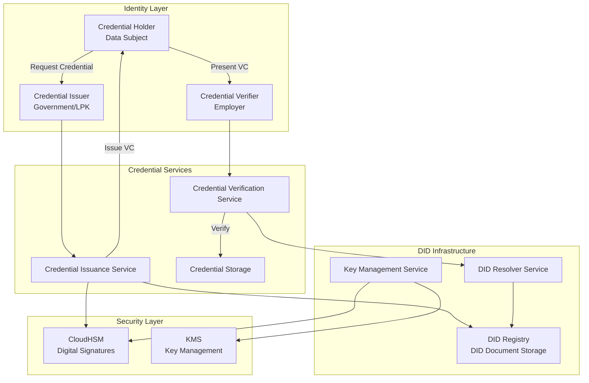
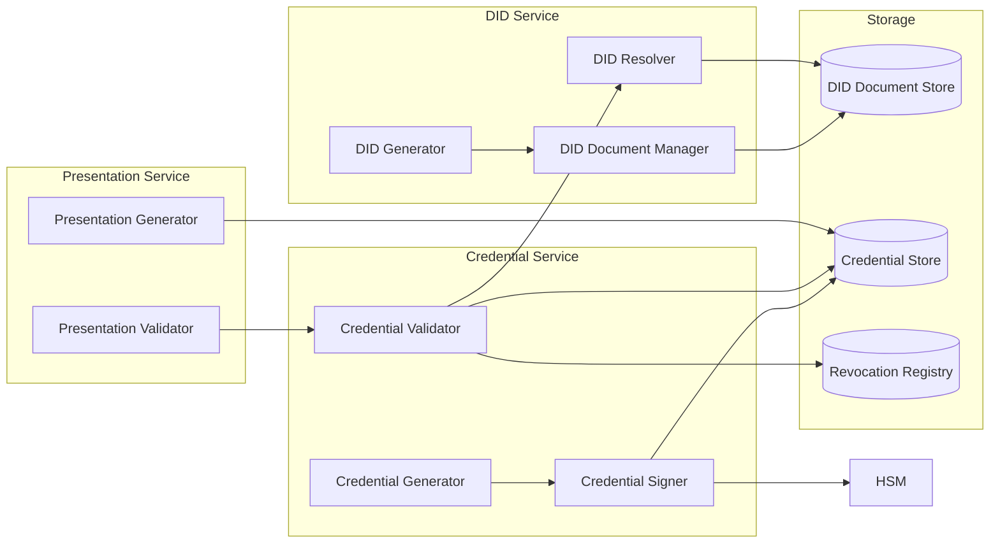

# Distributed Identity (DIDs) Implementation Plan

## Executive Summary

This document outlines the implementation plan for Distributed Identity (DIDs) based on W3C Verifiable Credentials standards, enabling self-sovereign identity for Indonesia's vocational ecosystem while maintaining compliance with UU PDP Law No. 27/2022.

## 1. Standards and Specifications

### 1.1 W3C Standards

- **DID Core**: W3C Decentralized Identifiers (DIDs) v1.0
- **Verifiable Credentials**: W3C Verifiable Credentials Data Model v2.0
- **Verifiable Presentations**: W3C Verifiable Presentations
- **DID Resolution**: DID Resolution specification

### 1.2 Supported DID Methods

| DID Method | Use Case | Status |
|------------|----------|--------|
| `did:web` | Primary method for web-based resolution | Implemented |
| `did:key` | Simple key-based DIDs for testing | Implemented |
| `did:ion` | Microsoft ION (Bitcoin-based) | Future |
| `did:polygonid` | Polygon ID (Blockchain-based) | Future |

### 1.3 Credential Formats

- **JSON-LD**: Primary format (W3C standard)
- **JWT**: Alternative format for lightweight credentials
- **CBOR**: Binary format for mobile applications (future)

## 2. Architecture Overview

### 2.1 DID Ecosystem Architecture



### 2.2 Component Architecture



## 3. DID Implementation

### 3.1 DID Document Structure

```json
{
  "@context": [
    "https://www.w3.org/ns/did/v1",
    "https://w3id.org/security/suites/ed25519-2020/v1"
  ],
  "id": "did:web:dgihub.go.id:issuers:gov-indonesia",
  "controller": "did:web:dgihub.go.id:issuers:gov-indonesia",
  "verificationMethod": [
    {
      "id": "did:web:dgihub.go.id:issuers:gov-indonesia#keys-1",
      "type": "EcdsaSecp256r1VerificationKey2019",
      "controller": "did:web:dgihub.go.id:issuers:gov-indonesia",
      "publicKeyJwk": {
        "kty": "EC",
        "crv": "P-256",
        "x": "base64url-encoded-x",
        "y": "base64url-encoded-y"
      }
    }
  ],
  "authentication": [
    "did:web:dgihub.go.id:issuers:gov-indonesia#keys-1"
  ],
  "assertionMethod": [
    "did:web:dgihub.go.id:issuers:gov-indonesia#keys-1"
  ],
  "service": [
    {
      "id": "did:web:dgihub.go.id:issuers:gov-indonesia#credential-issuance",
      "type": "CredentialIssuanceService",
      "serviceEndpoint": "https://api.dgihub.go.id/v1/credentials/issue"
    },
    {
      "id": "did:web:dgihub.go.id:issuers:gov-indonesia#revocation",
      "type": "RevocationList2020",
      "serviceEndpoint": "https://api.dgihub.go.id/v1/credentials/revocation"
    }
  ]
}
```

### 3.2 DID Generation Service

```python
class DIDGenerator:
    """Generate and manage DIDs"""
    
    def __init__(self):
        self.hsm_client = CloudHSMClient()
        self.did_registry = DIDRegistry()
    
    async def generate_did(
        self,
        tenant_id: UUID,
        tenant_type: str,  # 'GOV', 'LPK', 'EMP'
        key_alias: str = None
    ) -> dict:
        """Generate a new DID for issuer"""
        
        # Generate key pair in HSM
        if not key_alias:
            key_alias = f"did-key-{tenant_id}"
        
        key_pair = await self.hsm_client.generate_key_pair(
            key_alias=key_alias,
            algorithm='ECDSA_P256'
        )
        
        # Generate DID identifier
        did_identifier = self.generate_did_identifier(tenant_id, tenant_type)
        did = f"did:web:dgihub.go.id:{did_identifier}"
        
        # Create DID Document
        did_document = await self.create_did_document(
            did=did,
            public_key_jwk=key_pair['public_key_jwk'],
            tenant_id=tenant_id
        )
        
        # Store DID Document
        await self.did_registry.store_did_document(did, did_document)
        
        # Register DID
        await self.register_did(did, did_document)
        
        return {
            'did': did,
            'did_document': did_document,
            'key_alias': key_alias
        }
    
    def generate_did_identifier(
        self,
        tenant_id: UUID,
        tenant_type: str
    ) -> str:
        """Generate DID identifier based on tenant"""
        
        if tenant_type == 'GOV':
            return f"issuers:gov-{tenant_id}"
        elif tenant_type == 'LPK':
            return f"issuers:lpk-{tenant_id}"
        elif tenant_type == 'EMP':
            return f"verifiers:emp-{tenant_id}"
        else:
            raise InvalidTenantTypeError(f"Invalid tenant type: {tenant_type}")
    
    async def create_did_document(
        self,
        did: str,
        public_key_jwk: dict,
        tenant_id: UUID
    ) -> dict:
        """Create DID Document"""
        
        verification_method_id = f"{did}#keys-1"
        
        return {
            "@context": [
                "https://www.w3.org/ns/did/v1",
                "https://w3id.org/security/suites/ecdsa-2019/v1"
            ],
            "id": did,
            "controller": did,
            "verificationMethod": [
                {
                    "id": verification_method_id,
                    "type": "EcdsaSecp256r1VerificationKey2019",
                    "controller": did,
                    "publicKeyJwk": public_key_jwk
                }
            ],
            "authentication": [verification_method_id],
            "assertionMethod": [verification_method_id],
            "service": [
                {
                    "id": f"{did}#credential-issuance",
                    "type": "CredentialIssuanceService",
                    "serviceEndpoint": f"https://api.dgihub.go.id/v1/credentials/issue"
                },
                {
                    "id": f"{did}#revocation",
                    "type": "RevocationList2020",
                    "serviceEndpoint": f"https://api.dgihub.go.id/v1/credentials/revocation"
                }
            ],
            "created": datetime.now().isoformat(),
            "updated": datetime.now().isoformat()
        }
```

### 3.3 DID Resolution Service

```python
class DIDResolver:
    """Resolve DIDs to DID Documents"""
    
    def __init__(self):
        self.did_registry = DIDRegistry()
        self.cache = RedisCache()
    
    async def resolve_did(self, did: str) -> dict:
        """Resolve DID to DID Document"""
        
        # Check cache first
        cached_doc = await self.cache.get(f"did:{did}")
        if cached_doc:
            return cached_doc
        
        # Parse DID
        parsed = self.parse_did(did)
        
        if parsed['method'] == 'web':
            # Resolve did:web
            did_document = await self.resolve_web_did(parsed)
        elif parsed['method'] == 'key':
            # Resolve did:key
            did_document = await self.resolve_key_did(parsed)
        else:
            raise UnsupportedDIDMethodError(f"Unsupported DID method: {parsed['method']}")
        
        # Cache for 1 hour
        await self.cache.set(f"did:{did}", did_document, ttl=3600)
        
        return did_document
    
    async def resolve_web_did(self, parsed: dict) -> dict:
        """Resolve did:web DID"""
        
        # Extract identifier
        identifier = parsed['identifier']
        
        # Check local registry first
        did_document = await self.did_registry.get_did_document(parsed['did'])
        if did_document:
            return did_document
        
        # Resolve from web
        # did:web:dgihub.go.id:issuers:gov-123
        # -> https://dgihub.go.id/.well-known/did.json
        # or -> https://dgihub.go.id/issuers/gov-123/did.json
        
        domain = parsed['domain']
        path = parsed.get('path', '')
        
        if path:
            url = f"https://{domain}/{path}/did.json"
        else:
            url = f"https://{domain}/.well-known/did.json"
        
        # Fetch DID Document
        async with httpx.AsyncClient() as client:
            response = await client.get(url)
            response.raise_for_status()
            did_document = response.json()
        
        # Validate DID Document
        await self.validate_did_document(did_document, parsed['did'])
        
        return did_document
    
    def parse_did(self, did: str) -> dict:
        """Parse DID into components"""
        # did:web:dgihub.go.id:issuers:gov-123
        parts = did.split(':')
        
        if len(parts) < 3:
            raise InvalidDIDError("Invalid DID format")
        
        method = parts[1]
        identifier_parts = parts[2:]
        identifier = ':'.join(identifier_parts)
        
        # Parse web DID
        if method == 'web':
            domain_parts = identifier.split('/')
            domain = domain_parts[0]
            path = '/'.join(domain_parts[1:]) if len(domain_parts) > 1 else None
        else:
            domain = None
            path = None
        
        return {
            'did': did,
            'method': method,
            'identifier': identifier,
            'domain': domain,
            'path': path
        }
```

## 4. Verifiable Credential Implementation

### 4.1 Credential Structure

```json
{
  "@context": [
    "https://www.w3.org/2018/credentials/v1",
    "https://dgihub.go.id/contexts/vocational-credential/v1"
  ],
  "id": "https://dgihub.go.id/credentials/550e8400-e29b-41d4-a716-446655440000",
  "type": [
    "VerifiableCredential",
    "VocationalTrainingCredential"
  ],
  "issuer": {
    "id": "did:web:dgihub.go.id:issuers:lpk-123",
    "name": "LPK Teknologi Indonesia"
  },
  "issuanceDate": "2024-01-15T10:30:00Z",
  "expirationDate": "2029-01-15T10:30:00Z",
  "credentialSubject": {
    "id": "did:key:z6MkhaXgBZDvotDkL5257faiztiGiC2QtKLGpbnnEGta2doK",
    "type": "Person",
    "nik": "encrypted-nik-reference",
    "name": "John Doe",
    "trainingProgram": {
      "id": "https://dgihub.go.id/programs/tech-training-2024",
      "name": "Advanced Software Development",
      "duration": "6 months",
      "completionDate": "2024-01-10",
      "certificateNumber": "CERT-2024-001234"
    },
    "competencies": [
      {
        "skill": "Python Programming",
        "level": "Advanced",
        "verified": true
      },
      {
        "skill": "Database Design",
        "level": "Intermediate",
        "verified": true
      }
    ]
  },
  "credentialStatus": {
    "id": "https://dgihub.go.id/credentials/status/550e8400-e29b-41d4-a716-446655440000",
    "type": "RevocationList2020",
    "revocationListIndex": "94567",
    "revocationListCredential": "https://dgihub.go.id/credentials/revocation-list/2024"
  },
  "proof": {
    "type": "EcdsaSecp256r1Signature2019",
    "created": "2024-01-15T10:30:00Z",
    "verificationMethod": "did:web:dgihub.go.id:issuers:lpk-123#keys-1",
    "proofPurpose": "assertionMethod",
    "jws": "eyJhbGciOiJFUzI1NkstUiIsImI2NCI6ZmFsc2UsImNyaXQiOlsiYjY0Il19..."
  }
}
```

### 4.2 Credential Issuance Service

```python
class CredentialIssuanceService:
    """Issue verifiable credentials"""
    
    def __init__(self):
        self.hsm_signer = HSMDigitalSignature()
        self.did_resolver = DIDResolver()
        self.revocation_registry = RevocationRegistry()
    
    async def issue_credential(
        self,
        issuer_did: str,
        credential_subject: dict,
        credential_type: str,
        expiration_days: int = 1825  # 5 years
    ) -> dict:
        """Issue a verifiable credential"""
        
        # Resolve issuer DID
        issuer_did_doc = await self.did_resolver.resolve_did(issuer_did)
        
        # Validate issuer
        if not await self.validate_issuer(issuer_did):
            raise InvalidIssuerError("Issuer not authorized")
        
        # Create credential
        credential = {
            "@context": [
                "https://www.w3.org/2018/credentials/v1",
                "https://dgihub.go.id/contexts/vocational-credential/v1"
            ],
            "id": f"https://dgihub.go.id/credentials/{uuid.uuid4()}",
            "type": [
                "VerifiableCredential",
                credential_type
            ],
            "issuer": {
                "id": issuer_did,
                "name": issuer_did_doc.get("name", "Unknown Issuer")
            },
            "issuanceDate": datetime.now().isoformat() + "Z",
            "expirationDate": (
                datetime.now() + timedelta(days=expiration_days)
            ).isoformat() + "Z",
            "credentialSubject": credential_subject
        }
        
        # Add credential status (revocation)
        credential_status = await self.revocation_registry.register_credential(
            credential_id=credential["id"]
        )
        credential["credentialStatus"] = credential_status
        
        # Sign credential using HSM
        proof = await self.hsm_signer.sign_credential(
            credential_data=credential,
            issuer_did=issuer_did,
            verification_method=issuer_did_doc["verificationMethod"][0]["id"]
        )
        credential["proof"] = proof
        
        # Store credential
        await self.store_credential(credential)
        
        # Log issuance
        await self.audit_log.record_credential_issuance(credential)
        
        return credential
    
    async def validate_issuer(self, issuer_did: str) -> bool:
        """Validate issuer is authorized"""
        
        # Check if issuer DID is registered
        issuer = await self.get_issuer_by_did(issuer_did)
        
        if not issuer:
            return False
        
        # Check issuer status
        if issuer.status != 'ACTIVE':
            return False
        
        # Check issuer type matches credential type
        # (e.g., only LPKs can issue training credentials)
        
        return True
```

### 4.3 Credential Verification Service

```python
class CredentialVerificationService:
    """Verify verifiable credentials"""
    
    def __init__(self):
        self.did_resolver = DIDResolver()
        self.revocation_registry = RevocationRegistry()
        self.hsm_verifier = HSMDigitalSignature()
    
    async def verify_credential(
        self,
        credential: dict,
        verify_revocation: bool = True
    ) -> dict:
        """Verify a verifiable credential"""
        
        verification_result = {
            'valid': False,
            'checks': {},
            'errors': []
        }
        
        # Check 1: Verify credential structure
        structure_valid = await self.verify_structure(credential)
        verification_result['checks']['structure'] = structure_valid
        if not structure_valid:
            verification_result['errors'].append('Invalid credential structure')
            return verification_result
        
        # Check 2: Verify signature
        signature_valid = await self.verify_signature(credential)
        verification_result['checks']['signature'] = signature_valid
        if not signature_valid:
            verification_result['errors'].append('Invalid credential signature')
            return verification_result
        
        # Check 3: Verify issuer DID
        issuer_valid = await self.verify_issuer(credential)
        verification_result['checks']['issuer'] = issuer_valid
        if not issuer_valid:
            verification_result['errors'].append('Invalid or unauthorized issuer')
            return verification_result
        
        # Check 4: Verify expiration
        expiration_valid = await self.verify_expiration(credential)
        verification_result['checks']['expiration'] = expiration_valid
        if not expiration_valid:
            verification_result['errors'].append('Credential has expired')
            return verification_result
        
        # Check 5: Verify revocation (if enabled)
        if verify_revocation:
            revocation_valid = await self.verify_revocation(credential)
            verification_result['checks']['revocation'] = revocation_valid
            if not revocation_valid:
                verification_result['errors'].append('Credential has been revoked')
                return verification_result
        
        # All checks passed
        verification_result['valid'] = True
        
        # Log verification
        await self.audit_log.record_credential_verification(
            credential, verification_result
        )
        
        return verification_result
    
    async def verify_signature(self, credential: dict) -> bool:
        """Verify credential signature"""
        
        proof = credential.get('proof')
        if not proof:
            return False
        
        # Resolve issuer DID
        issuer_did = credential['issuer']['id']
        issuer_did_doc = await self.did_resolver.resolve_did(issuer_did)
        
        # Get verification method
        verification_method_id = proof['verificationMethod']
        verification_method = next(
            (vm for vm in issuer_did_doc['verificationMethod'] 
             if vm['id'] == verification_method_id),
            None
        )
        
        if not verification_method:
            return False
        
        # Extract public key
        public_key_jwk = verification_method['publicKeyJwk']
        
        # Verify signature using HSM
        return await self.hsm_verifier.verify_signature(
            credential=credential,
            public_key=public_key_jwk
        )
    
    async def verify_revocation(self, credential: dict) -> bool:
        """Verify credential is not revoked"""
        
        credential_status = credential.get('credentialStatus')
        if not credential_status:
            # No revocation status means not revocable
            return True
        
        # Check revocation registry
        is_revoked = await self.revocation_registry.is_revoked(
            credential_id=credential['id'],
            revocation_list_index=credential_status.get('revocationListIndex')
        )
        
        return not is_revoked
```

## 5. Revocation Registry

### 5.1 Revocation List Implementation

```python
class RevocationRegistry:
    """Manage credential revocation"""
    
    def __init__(self):
        self.db = Database()
        self.hsm_signer = HSMDigitalSignature()
    
    async def register_credential(
        self,
        credential_id: str
    ) -> dict:
        """Register credential in revocation registry"""
        
        # Get current revocation list
        revocation_list = await self.get_current_revocation_list()
        
        # Add credential to list
        index = len(revocation_list['revokedCredentialIndices'])
        revocation_list['revokedCredentialIndices'].append({
            'credentialId': credential_id,
            'index': index,
            'revoked': False  # Not revoked yet
        })
        
        # Update revocation list
        await self.update_revocation_list(revocation_list)
        
        return {
            "id": f"{credential_id}/status",
            "type": "RevocationList2020",
            "revocationListIndex": str(index),
            "revocationListCredential": revocation_list['id']
        }
    
    async def revoke_credential(
        self,
        credential_id: str,
        reason: str = None
    ):
        """Revoke a credential"""
        
        # Find credential in revocation list
        credential_entry = await self.find_credential_in_list(credential_id)
        
        if not credential_entry:
            raise CredentialNotFoundError("Credential not found in revocation list")
        
        # Mark as revoked
        credential_entry['revoked'] = True
        credential_entry['revokedAt'] = datetime.now().isoformat()
        credential_entry['reason'] = reason
        
        # Update revocation list
        revocation_list = await self.get_revocation_list(
            credential_entry['revocationListId']
        )
        await self.update_revocation_list(revocation_list)
        
        # Sign updated revocation list
        await self.sign_revocation_list(revocation_list)
        
        # Log revocation
        await self.audit_log.record_credential_revocation(
            credential_id, reason
        )
    
    async def is_revoked(
        self,
        credential_id: str,
        revocation_list_index: str = None
    ) -> bool:
        """Check if credential is revoked"""
        
        if revocation_list_index:
            # Direct lookup by index
            revocation_list = await self.get_current_revocation_list()
            index = int(revocation_list_index)
            
            if index < len(revocation_list['revokedCredentialIndices']):
                entry = revocation_list['revokedCredentialIndices'][index]
                return entry.get('revoked', False)
        
        # Search by credential ID
        entry = await self.find_credential_in_list(credential_id)
        if entry:
            return entry.get('revoked', False)
        
        return False
```

## 6. Verifiable Presentations

### 6.1 Presentation Generation

```python
class VerifiablePresentationService:
    """Generate and verify verifiable presentations"""
    
    async def create_presentation(
        self,
        holder_did: str,
        credentials: list,
        challenge: str = None,
        domain: str = None
    ) -> dict:
        """Create a verifiable presentation"""
        
        presentation = {
            "@context": [
                "https://www.w3.org/2018/credentials/v1"
            ],
            "type": ["VerifiablePresentation"],
            "holder": holder_did,
            "verifiableCredential": credentials,
            "proof": None
        }
        
        # Add challenge and domain if provided
        if challenge:
            presentation["challenge"] = challenge
        if domain:
            presentation["domain"] = domain
        
        # Sign presentation (holder signs)
        proof = await self.sign_presentation(
            presentation=presentation,
            holder_did=holder_did
        )
        presentation["proof"] = proof
        
        return presentation
    
    async def verify_presentation(
        self,
        presentation: dict
    ) -> dict:
        """Verify a verifiable presentation"""
        
        # Verify presentation structure
        # Verify holder signature
        # Verify all credentials in presentation
        # Verify challenge (if present)
        
        pass
```

## 7. Integration with Existing Systems

### 7.1 Integration Points

1. **Credential Issuance**:
   - LPK issues training completion credentials
   - Government issues official recognition credentials
   - Integration with existing credential management system

2. **Credential Verification**:
   - Employers verify candidate credentials
   - Government verifies LPK-issued credentials
   - Integration with hiring systems

3. **Identity Management**:
   - Link DIDs to NIK (encrypted)
   - Biometric binding to DID
   - Integration with e-KYC system

## 8. Privacy Considerations

### 8.1 Selective Disclosure

- **Zero-Knowledge Proofs**: Future implementation for selective disclosure
- **Minimal Disclosure**: Only reveal necessary credential attributes
- **Consent-Based Sharing**: Require explicit consent for credential sharing

### 8.2 UU PDP Compliance

- **Data Minimization**: Only store necessary data in credentials
- **Consent Management**: Link credential sharing to consent records
- **Right to Erasure**: Support credential revocation and deletion
- **Audit Logging**: Log all credential operations

## 9. Implementation Roadmap

### Phase 1: Foundation (Weeks 1-6)
- [ ] Set up DID infrastructure
- [ ] Implement DID generation and resolution
- [ ] Integrate with CloudHSM for signing
- [ ] Build DID registry

### Phase 2: Credentials (Weeks 7-12)
- [ ] Implement credential issuance
- [ ] Build credential verification
- [ ] Create revocation registry
- [ ] Define credential schemas

### Phase 3: Integration (Weeks 13-18)
- [ ] Integrate with credential management system
- [ ] Build presentation service
- [ ] Integrate with e-KYC
- [ ] API development

### Phase 4: Testing (Weeks 19-24)
- [ ] Unit testing
- [ ] Integration testing
- [ ] Security testing
- [ ] Compliance validation

### Phase 5: Deployment (Weeks 25-30)
- [ ] Staging deployment
- [ ] Pilot testing with select LPKs
- [ ] Production deployment
- [ ] Documentation and training

## 10. Success Metrics

- **DID Generation**: < 1 second
- **Credential Issuance**: < 2 seconds
- **Credential Verification**: < 500ms
- **DID Resolution**: < 200ms (cached), < 2s (uncached)
- **Uptime**: 99.9%
- **Security**: Zero credential forgery incidents


