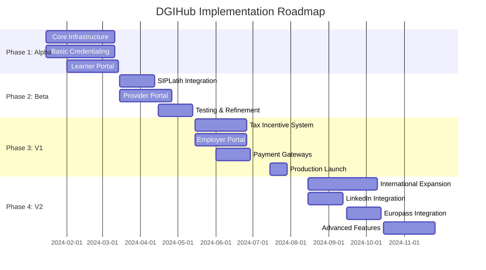

# Implementation Roadmap

## Overview

This document outlines the 4-phase implementation timeline for the DGIHub platform, from Alpha to V2 with international expansion.

## Phase Timeline

## Phase 1: Alpha (Weeks 1-12)

### Objectives
- Build core infrastructure
- Implement basic credentialing system
- Launch learner portal MVP
- Establish foundation for future phases

### Deliverables

#### Infrastructure (Weeks 1-8)
- [ ] AWS infrastructure setup (VPC, ECS, RDS, S3)
- [ ] CloudHSM cluster configuration
- [ ] Database schema deployment
- [ ] API Gateway setup
- [ ] Basic authentication system
- [ ] Monitoring and logging setup

#### Core Credentialing (Weeks 1-8)
- [ ] Credential issuance service
- [ ] Open Badges 3.0 implementation
- [ ] Basic SKKNI mapping
- [ ] Credential storage and retrieval
- [ ] Digital signature with HSM

#### Learner Portal (Weeks 3-12)
- [ ] User registration and authentication
- [ ] Dashboard with credential overview
- [ ] Credential viewing and sharing
- [ ] Basic profile management
- [ ] Mobile-responsive design
- [ ] Dark mode support

#### LRS Foundation (Weeks 5-10)
- [ ] xAPI statement storage
- [ ] Basic learning activity tracking
- [ ] Attendance recording (without GPS initially)

### Success Criteria
- ✅ Infrastructure deployed and stable
- ✅ Credentials can be issued and viewed
- ✅ Learner portal functional on mobile and desktop
- ✅ Basic authentication working
- ✅ System handles 1,000 concurrent users

### Risks & Mitigation
- **Risk**: Infrastructure complexity
  - **Mitigation**: Use Infrastructure as Code, thorough testing
- **Risk**: HSM integration delays
  - **Mitigation**: Early HSM setup, fallback to KMS initially

## Phase 2: Beta / SIPLatih Integration (Weeks 13-20)

### Objectives
- Integrate with SIPLatih (Ministry of Manpower)
- Launch provider portal
- Enhance learner portal
- Begin user testing

### Deliverables

#### SIPLatih Integration (Weeks 13-16)
- [ ] OAuth 2.0 authentication with SIPLatih
- [ ] Training program registration API
- [ ] Completion reporting API
- [ ] Credential verification API
- [ ] Error handling and retry logic
- [ ] Data synchronization

#### Provider Portal (Weeks 13-20)
- [ ] LPK registration and onboarding
- [ ] Training program management
- [ ] Student enrollment system
- [ ] Basic reporting dashboard
- [ ] Accreditation tracking (basic)
- [ ] Mobile-responsive design

#### Enhanced Learner Portal (Weeks 15-20)
- [ ] Training program enrollment
- [ ] Learning progress tracking
- [ ] Enhanced credential display
- [ ] Social sharing features
- [ ] Export functionality (PDF)

#### TeFa Foundation (Weeks 17-20)
- [ ] Basic TeFa location management
- [ ] Student rotation assignment
- [ ] Attendance tracking (basic, no GPS yet)

### Success Criteria
- ✅ SIPLatih integration functional
- ✅ Providers can register and manage programs
- ✅ Learners can enroll in programs
- ✅ Credentials automatically reported to SIPLatih
- ✅ System handles 10,000 concurrent users

### Beta Testing
- **Participants**: 5 LPKs, 100 learners, 10 employers
- **Duration**: 4 weeks
- **Focus**: Usability, performance, integration stability

## Phase 3: V1 / Tax Incentive (Weeks 21-32)

### Objectives
- Implement 200% tax deduction system
- Launch employer portal
- Integrate payment gateways
- Production launch

### Deliverables

#### Tax Incentive System (Weeks 21-26)
- [ ] Training cost registration
- [ ] Tax deduction calculation engine
- [ ] Verification workflow
- [ ] Automatic eligibility checking
- [ ] Tax reporting generation
- [ ] Document management

#### Employer Portal (Weeks 21-28)
- [ ] Company registration and verification
- [ ] Talent search functionality
- [ ] Credential verification
- [ ] Tax incentive dashboard
- [ ] Reporting and analytics
- [ ] Candidate management

#### Payment Gateways (Weeks 25-28)
- [ ] GoPay integration
- [ ] LinkAja integration
- [ ] OVO integration
- [ ] Payment status tracking
- [ ] Webhook handling
- [ ] Refund processing

#### Enhanced Features (Weeks 27-30)
- [ ] GPS-based TeFa attendance
- [ ] Geofence validation
- [ ] Real-time notifications
- [ ] Advanced search and filters
- [ ] Bulk operations

#### Production Preparation (Weeks 29-32)
- [ ] Security audit
- [ ] Performance optimization
- [ ] Load testing
- [ ] Disaster recovery testing
- [ ] Documentation completion
- [ ] Training materials

### Success Criteria
- ✅ Tax deduction system fully functional
- ✅ Employers can search and verify talent
- ✅ Payment processing working
- ✅ System handles 50,000 concurrent users
- ✅ 99.9% uptime achieved

### Production Launch
- **Date**: Week 32
- **Scope**: Full platform launch
- **Marketing**: Government announcement, LPK outreach

## Phase 4: V2 / International (Weeks 33-48)

### Objectives
- International credential recognition
- Advanced integrations (LinkedIn, Europass)
- Enhanced features
- Scale for growth

### Deliverables

#### International Expansion (Weeks 33-40)
- [ ] AQRF mapping enhancement
- [ ] Multi-language support (English, Bahasa Indonesia)
- [ ] International credential export
- [ ] Cross-border verification
- [ ] Regional partnerships

#### LinkedIn Integration (Weeks 33-36)
- [ ] OAuth 2.0 authentication
- [ ] Credential sharing API
- [ ] Profile integration
- [ ] Automatic posting
- [ ] Analytics tracking

#### Europass Integration (Weeks 37-40)
- [ ] Europass credential generation
- [ ] API integration
- [ ] QR code generation
- [ ] European recognition
- [ ] Export functionality

#### Advanced Features (Weeks 41-48)
- [ ] Blockchain anchoring (full implementation)
- [ ] Advanced analytics and insights
- [ ] AI-powered skill matching
- [ ] Recommendation engine
- [ ] Social learning features
- [ ] Gamification elements

#### Mobile App (Weeks 39-48)
- [ ] Native iOS app
- [ ] Native Android app
- [ ] Offline support
- [ ] Push notifications
- [ ] Biometric authentication

### Success Criteria
- ✅ International credentials recognized
- ✅ LinkedIn and Europass integrations working
- ✅ Mobile apps launched
- ✅ System handles 100,000+ concurrent users
- ✅ Global partnerships established

## Resource Allocation

### Team Structure

**Phase 1-2:**
- 2 Backend Engineers
- 2 Frontend Engineers
- 1 DevOps Engineer
- 1 UI/UX Designer
- 1 QA Engineer
- 1 Product Manager

**Phase 3:**
- 3 Backend Engineers
- 3 Frontend Engineers
- 2 DevOps Engineers
- 1 UI/UX Designer
- 2 QA Engineers
- 1 Product Manager
- 1 Security Engineer

**Phase 4:**
- 4 Backend Engineers
- 4 Frontend Engineers
- 2 Mobile Engineers
- 2 DevOps Engineers
- 2 UI/UX Designers
- 3 QA Engineers
- 1 Product Manager
- 1 Security Engineer
- 1 Data Scientist

## Budget Estimate

| Phase | Duration | Estimated Cost |
|-------|----------|----------------|
| Phase 1: Alpha | 12 weeks | $150,000 |
| Phase 2: Beta | 8 weeks | $120,000 |
| Phase 3: V1 | 12 weeks | $200,000 |
| Phase 4: V2 | 16 weeks | $300,000 |
| **Total** | **48 weeks** | **$770,000** |

*Note: Costs include development, infrastructure, and third-party services*

## Risk Management

### Technical Risks

| Risk | Probability | Impact | Mitigation |
|------|------------|--------|------------|
| Infrastructure delays | Medium | High | Early setup, cloud expertise |
| Integration complexity | High | Medium | Phased approach, API contracts |
| Performance issues | Medium | High | Load testing, optimization |
| Security vulnerabilities | Low | Critical | Security audits, penetration testing |

### Business Risks

| Risk | Probability | Impact | Mitigation |
|------|------------|--------|------------|
| Low adoption | Medium | High | Beta testing, user feedback |
| Regulatory changes | Low | High | Close government collaboration |
| Competition | Medium | Medium | Unique features, partnerships |

## Success Metrics

### Phase 1 (Alpha)
- 1,000 registered users
- 100 credentials issued
- 95% uptime
- < 2s page load time

### Phase 2 (Beta)
- 5,000 registered users
- 1,000 credentials issued
- 10 LPKs onboarded
- 98% uptime
- SIPLatih integration success rate > 95%

### Phase 3 (V1)
- 50,000 registered users
- 10,000 credentials issued
- 100 LPKs onboarded
- 50 employers onboarded
- 99% uptime
- Tax deduction processing < 24 hours

### Phase 4 (V2)
- 200,000 registered users
- 50,000 credentials issued
- 500 LPKs onboarded
- 500 employers onboarded
- 99.9% uptime
- International recognition in 5+ countries

## Post-Launch Roadmap

### Year 2
- AI-powered learning recommendations
- Advanced analytics dashboard
- Mobile app enhancements
- Additional payment methods
- Regional expansion (Southeast Asia)

### Year 3
- Blockchain-based credential marketplace
- Decentralized identity (full DID implementation)
- Advanced TeFa management
- Industry-specific portals
- Global partnerships

---

**Last Updated**: 2024-01-15  
**Version**: 1.0.0

