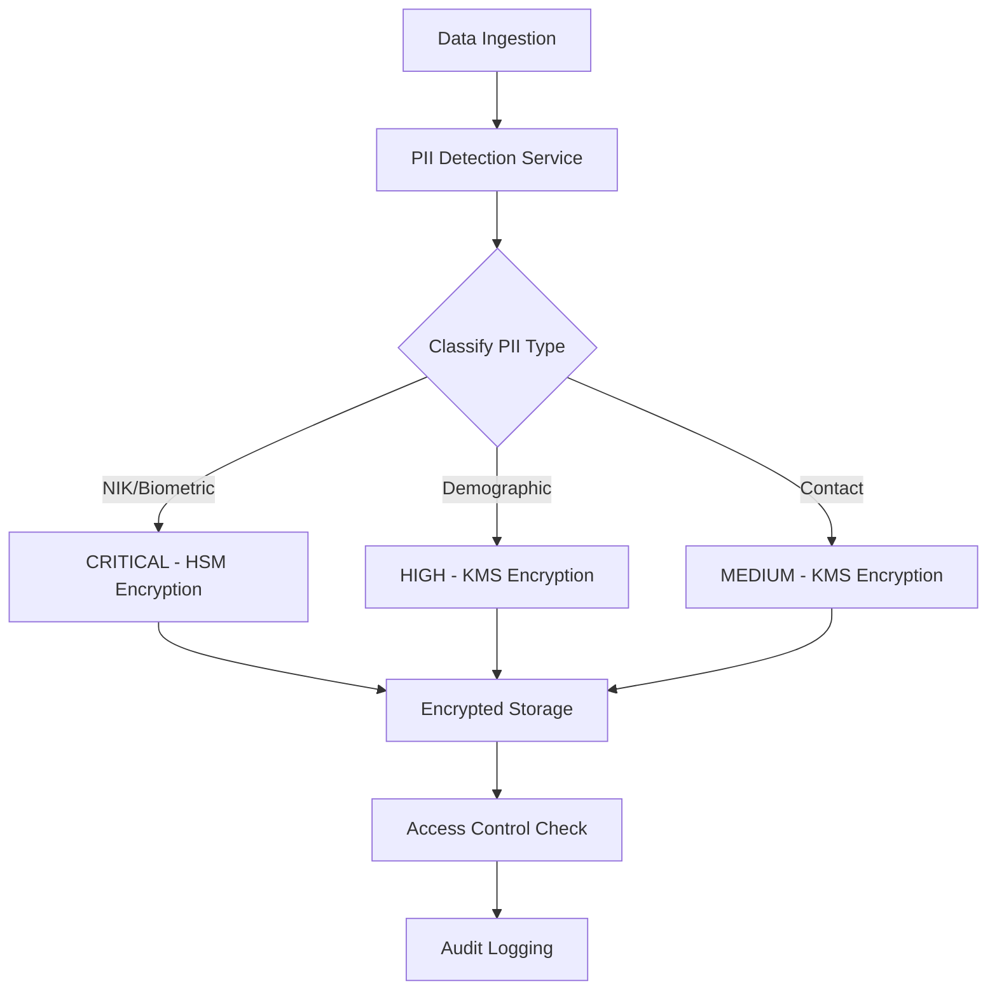
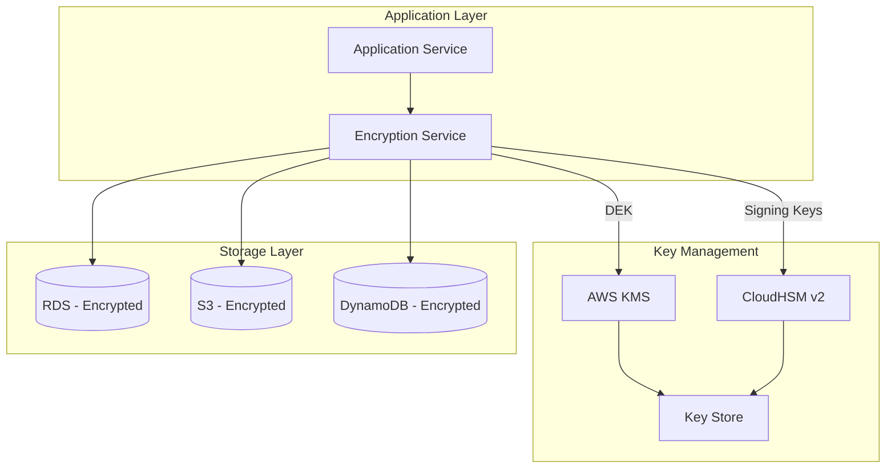
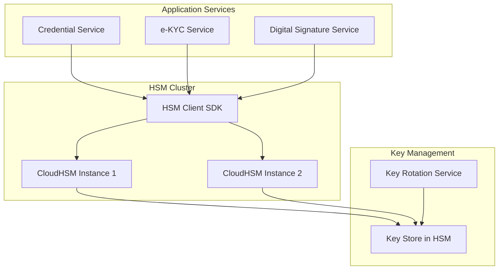
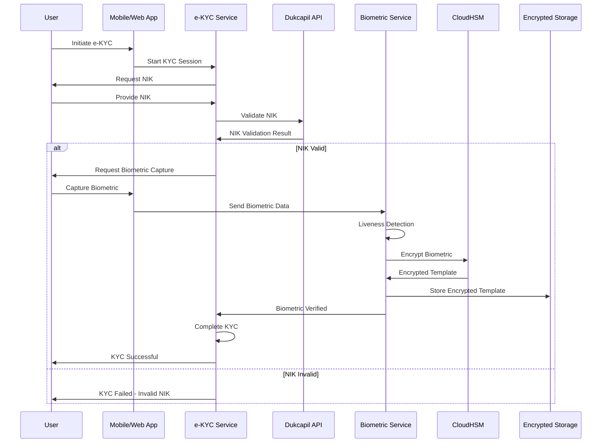

# Security Protocol for Personally Identifiable Information (PII)

## Executive Summary

This document defines comprehensive security protocols for handling Personally Identifiable Information (PII) in compliance with UU PDP Law No. 27/2022 and ISO 27001 standards. It covers encryption, access controls, HSM usage, and e-KYC processes.

## 1. PII Classification

### 1.1 PII Categories

| Category | Examples | Sensitivity Level | Encryption Required | Retention Period |
|----------|----------|-------------------|---------------------|------------------|
| **Identifiers** | NIK, Passport Number | CRITICAL | Yes (HSM) | 10 years |
| **Biometric** | Fingerprint, Face, Iris | CRITICAL | Yes (HSM) | 1 year (max) |
| **Demographic** | Name, DOB, Address | HIGH | Yes (KMS) | 7 years |
| **Contact** | Email, Phone | MEDIUM | Yes (KMS) | 5 years |
| **Financial** | Bank Account, Salary | HIGH | Yes (HSM) | 7 years |
| **Health** | Medical Records | CRITICAL | Yes (HSM) | 10 years |
| **Children's Data** | All categories | CRITICAL | Yes (HSM) | Special rules |

### 1.2 Data Classification Workflow



## 2. Encryption Strategy

### 2.1 Encryption Architecture



### 2.2 Encryption at Rest

#### Database Encryption

**RDS PostgreSQL Encryption:**
- **Encryption**: AES-256 using AWS KMS
- **Key Management**: Customer Managed Keys (CMK) in KMS
- **Key Rotation**: Automatic annual rotation
- **Encryption Scope**: Entire database instance

**Field-Level Encryption:**
```python
class FieldLevelEncryption:
    """Encrypt sensitive fields before database storage"""
    
    def __init__(self):
        self.kms_client = boto3.client('kms')
        self.hsm_client = CloudHSMClient()
    
    async def encrypt_nik(self, nik: str) -> dict:
        """Encrypt NIK using HSM (most sensitive)"""
        # Use HSM for NIK encryption
        encrypted = await self.hsm_client.encrypt(
            key_alias='pii-nik-encryption-key',
            plaintext=nik.encode('utf-8')
        )
        
        return {
            'encrypted_nik': base64.b64encode(encrypted).decode(),
            'key_id': 'pii-nik-encryption-key',
            'encryption_method': 'HSM_AES256'
        }
    
    async def encrypt_biometric(self, biometric_data: bytes) -> dict:
        """Encrypt biometric template using HSM"""
        # Biometric data must use HSM
        encrypted = await self.hsm_client.encrypt(
            key_alias='pii-biometric-encryption-key',
            plaintext=biometric_data
        )
        
        return {
            'encrypted_biometric': base64.b64encode(encrypted).decode(),
            'key_id': 'pii-biometric-encryption-key',
            'encryption_method': 'HSM_AES256',
            'hash': hashlib.sha256(biometric_data).hexdigest()  # For indexing
        }
    
    async def encrypt_demographic(self, data: dict) -> dict:
        """Encrypt demographic data using KMS"""
        # Use KMS for less sensitive data
        data_json = json.dumps(data)
        
        response = self.kms_client.encrypt(
            KeyId='alias/pii-demographic-key',
            Plaintext=data_json.encode('utf-8')
        )
        
        return {
            'encrypted_data': base64.b64encode(
                response['CiphertextBlob']
            ).decode(),
            'key_id': response['KeyId'],
            'encryption_method': 'KMS_AES256'
        }
```

#### S3 Object Encryption

**Configuration:**
```yaml
s3_encryption:
  server_side_encryption: SSE-KMS
  kms_key_id: arn:aws:kms:ap-southeast-5:account:key/pii-s3-key
  bucket_key_enabled: true
  encryption_context:
    data_classification: "PII"
    tenant_id: "${tenant_id}"
```

**Biometric Storage:**
- Separate S3 bucket: `dgihub-biometrics-prod`
- HSM-encrypted before upload
- Additional S3 encryption layer
- Access logging enabled
- Versioning enabled

### 2.3 Encryption in Transit

**TLS Configuration:**
- **Minimum Version**: TLS 1.3
- **Cipher Suites**: Only strong ciphers (AES-256-GCM, ChaCha20-Poly1305)
- **Certificate Management**: AWS Certificate Manager (ACM)
- **Certificate Rotation**: Automatic

**Service-to-Service Communication:**
- **mTLS**: Mutual TLS for all internal services
- **Service Mesh**: AWS App Mesh with Envoy proxies
- **Certificate Authority**: Private CA in AWS Certificate Manager Private CA

```yaml
tls_config:
  min_version: "1.3"
  cipher_suites:
    - TLS_AES_256_GCM_SHA384
    - TLS_CHACHA20_POLY1305_SHA256
    - TLS_AES_128_GCM_SHA256
  certificate_source: "ACM"
  mtls_required: true
  certificate_validation: "strict"
```

## 3. Hardware Security Module (HSM) Usage

### 3.1 HSM Architecture



### 3.2 HSM Use Cases

#### 3.2.1 Digital Signature for Verifiable Credentials

```python
class HSMDigitalSignature:
    """Generate digital signatures using HSM"""
    
    def __init__(self):
        self.hsm_client = CloudHSMClient()
        self.key_alias = 'credential-signing-key'
    
    async def sign_credential(
        self,
        credential_data: dict,
        issuer_tenant_id: UUID
    ) -> dict:
        """Sign verifiable credential using HSM"""
        
        # Prepare credential for signing
        credential_json = json.dumps(credential_data, sort_keys=True)
        credential_hash = hashlib.sha256(
            credential_json.encode('utf-8')
        ).digest()
        
        # Sign using HSM
        signature = await self.hsm_client.sign(
            key_alias=self.key_alias,
            data=credential_hash,
            algorithm='ECDSA_SHA256'
        )
        
        # Get public key for verification
        public_key = await self.hsm_client.get_public_key(
            key_alias=self.key_alias
        )
        
        return {
            'credential': credential_data,
            'proof': {
                'type': 'EcdsaSecp256r1Signature2019',
                'created': datetime.now().isoformat(),
                'verificationMethod': f"did:web:{issuer_tenant_id}#keys-1",
                'proofPurpose': 'assertionMethod',
                'jws': base64.b64encode(signature).decode()
            },
            'publicKey': public_key
        }
    
    async def verify_signature(
        self,
        credential: dict,
        public_key: str
    ) -> bool:
        """Verify credential signature"""
        
        # Extract signature
        signature = base64.b64decode(credential['proof']['jws'])
        
        # Recreate hash
        credential_data = {k: v for k, v in credential.items() if k != 'proof'}
        credential_json = json.dumps(credential_data, sort_keys=True)
        credential_hash = hashlib.sha256(
            credential_json.encode('utf-8')
        ).digest()
        
        # Verify using HSM
        return await self.hsm_client.verify(
            public_key=public_key,
            data=credential_hash,
            signature=signature,
            algorithm='ECDSA_SHA256'
        )
```

#### 3.2.2 NIK Encryption

```python
class HSMNIKEncryption:
    """Encrypt/decrypt NIK using HSM"""
    
    async def encrypt_nik(self, nik: str) -> str:
        """Encrypt NIK - most sensitive identifier"""
        
        # Validate NIK format (16 digits)
        if not self.validate_nik_format(nik):
            raise InvalidNIKError("Invalid NIK format")
        
        # Encrypt using HSM
        encrypted = await self.hsm_client.encrypt(
            key_alias='pii-nik-encryption-key',
            plaintext=nik.encode('utf-8'),
            algorithm='AES_256_GCM'
        )
        
        # Return base64 encoded
        return base64.b64encode(encrypted).decode()
    
    async def decrypt_nik(self, encrypted_nik: str) -> str:
        """Decrypt NIK - requires audit logging"""
        
        # Decrypt using HSM
        encrypted_bytes = base64.b64decode(encrypted_nik)
        decrypted = await self.hsm_client.decrypt(
            key_alias='pii-nik-encryption-key',
            ciphertext=encrypted_bytes,
            algorithm='AES_256_GCM'
        )
        
        nik = decrypted.decode('utf-8')
        
        # Log decryption access
        await self.audit_log.record_nik_decryption(nik)
        
        return nik
```

#### 3.2.3 Biometric Template Encryption

```python
class HSMBiometricEncryption:
    """Encrypt biometric templates using HSM"""
    
    async def encrypt_biometric_template(
        self,
        template: bytes,
        biometric_type: str  # 'FINGERPRINT', 'FACE', 'IRIS'
    ) -> dict:
        """Encrypt biometric template"""
        
        # Validate template format
        if not self.validate_template_format(template, biometric_type):
            raise InvalidBiometricTemplateError("Invalid template format")
        
        # Encrypt using HSM
        encrypted = await self.hsm_client.encrypt(
            key_alias=f'pii-biometric-{biometric_type.lower()}-key',
            plaintext=template,
            algorithm='AES_256_GCM'
        )
        
        # Generate hash for indexing (one-way)
        template_hash = hashlib.sha256(template).hexdigest()
        
        return {
            'encrypted_template': base64.b64encode(encrypted).decode(),
            'template_hash': template_hash,  # For matching without decryption
            'biometric_type': biometric_type,
            'key_id': f'pii-biometric-{biometric_type.lower()}-key',
            'encrypted_at': datetime.now().isoformat()
        }
    
    async def match_biometric(
        self,
        encrypted_template1: dict,
        encrypted_template2: dict
    ) -> float:
        """Match biometrics without full decryption"""
        
        # Use template hashes for initial matching
        if encrypted_template1['template_hash'] == encrypted_template2['template_hash']:
            return 1.0
        
        # For detailed matching, decrypt in secure environment
        # This should only happen in isolated HSM environment
        template1 = await self.decrypt_template(encrypted_template1)
        template2 = await self.decrypt_template(encrypted_template2)
        
        # Perform matching algorithm
        similarity = await self.calculate_similarity(template1, template2)
        
        # Log matching attempt
        await self.audit_log.record_biometric_matching(
            encrypted_template1, encrypted_template2, similarity
        )
        
        return similarity
```

### 3.3 HSM Key Management

**Key Hierarchy:**
```
Master Key (HSM)
├── Credential Signing Keys
│   ├── Government Credentials (RSA 2048)
│   ├── LPK Credentials (ECDSA P-256)
│   └── Employer Credentials (ECDSA P-256)
├── PII Encryption Keys
│   ├── NIK Encryption (AES-256)
│   ├── Biometric Encryption (AES-256)
│   └── Financial Data Encryption (AES-256)
└── Key Derivation Keys
    └── Session Key Derivation (ECDH)
```

**Key Rotation Policy:**
- **Signing Keys**: Quarterly rotation
- **Encryption Keys**: Annual rotation
- **Key Lifecycle**: Generate → Active → Rotate → Archive → Destroy

## 4. e-KYC Flow: NIK Validation + Biometric Liveness

### 4.1 e-KYC Architecture



### 4.2 NIK Validation Implementation

```python
class NIKValidator:
    """Validate NIK against Dukcapil (Civil Registry)"""
    
    def __init__(self):
        self.dukcapil_client = DukcapilAPIClient()
        self.cache = RedisCache()
    
    async def validate_nik(
        self,
        nik: str,
        full_name: str = None,
        date_of_birth: str = None
    ) -> dict:
        """Validate NIK format and against Dukcapil database"""
        
        # Step 1: Format validation
        if not self.validate_nik_format(nik):
            return {
                'valid': False,
                'error': 'INVALID_FORMAT',
                'message': 'NIK must be 16 digits'
            }
        
        # Step 2: Check cache first
        cached_result = await self.cache.get(f'nik_validation:{nik}')
        if cached_result:
            return cached_result
        
        # Step 3: Validate against Dukcapil API
        try:
            dukcapil_response = await self.dukcapil_client.validate_nik(
                nik=nik,
                full_name=full_name,
                date_of_birth=date_of_birth
            )
            
            result = {
                'valid': dukcapil_response['status'] == 'VALID',
                'nik': nik,
                'data': {
                    'full_name': dukcapil_response.get('full_name'),
                    'date_of_birth': dukcapil_response.get('date_of_birth'),
                    'place_of_birth': dukcapil_response.get('place_of_birth'),
                    'gender': dukcapil_response.get('gender'),
                    'address': dukcapil_response.get('address')
                } if dukcapil_response['status'] == 'VALID' else None,
                'validated_at': datetime.now().isoformat()
            }
            
            # Cache result (5 minutes TTL)
            await self.cache.set(
                f'nik_validation:{nik}',
                result,
                ttl=300
            )
            
            # Log validation
            await self.audit_log.record_nik_validation(nik, result['valid'])
            
            return result
            
        except DukcapilAPIError as e:
            return {
                'valid': False,
                'error': 'API_ERROR',
                'message': str(e)
            }
    
    def validate_nik_format(self, nik: str) -> bool:
        """Validate NIK format (16 digits)"""
        if not nik or len(nik) != 16:
            return False
        
        if not nik.isdigit():
            return False
        
        # Additional format checks
        # NIK format: PPKKCCDDMMYYSSSS
        # PP = Province code (01-94)
        # KK = City/Regency code
        # CC = District code
        # DDMMYY = Date of birth
        # SSSS = Sequential number
        
        province_code = int(nik[0:2])
        if province_code < 1 or province_code > 94:
            return False
        
        return True
```

### 4.3 Biometric Liveness Detection

```python
class BiometricLivenessDetector:
    """Detect liveness in biometric capture"""
    
    def __init__(self):
        self.liveness_model = self.load_liveness_model()
        self.threshold = 0.95  # 95% confidence required
    
    async def detect_liveness(
        self,
        biometric_data: bytes,
        biometric_type: str,
        capture_metadata: dict
    ) -> dict:
        """Detect if biometric capture is from live person"""
        
        if biometric_type == 'FACE':
            return await self.detect_face_liveness(biometric_data, capture_metadata)
        elif biometric_type == 'FINGERPRINT':
            return await self.detect_fingerprint_liveness(biometric_data, capture_metadata)
        elif biometric_type == 'IRIS':
            return await self.detect_iris_liveness(biometric_data, capture_metadata)
        else:
            raise UnsupportedBiometricTypeError(f"Unsupported type: {biometric_type}")
    
    async def detect_face_liveness(
        self,
        image_data: bytes,
        metadata: dict
    ) -> dict:
        """Detect face liveness using multiple techniques"""
        
        # Technique 1: 3D depth analysis
        depth_analysis = await self.analyze_depth(image_data)
        
        # Technique 2: Blink detection
        blink_detection = await self.detect_blink(image_data, metadata.get('video_frames'))
        
        # Technique 3: Motion analysis
        motion_analysis = await self.analyze_motion(metadata.get('video_frames'))
        
        # Technique 4: Texture analysis (detect printed photos)
        texture_analysis = await self.analyze_texture(image_data)
        
        # Technique 5: Challenge-response (if available)
        challenge_response = metadata.get('challenge_response')
        if challenge_response:
            challenge_valid = await self.validate_challenge(challenge_response)
        else:
            challenge_valid = None
        
        # Combine results
        liveness_score = self.calculate_liveness_score(
            depth_analysis,
            blink_detection,
            motion_analysis,
            texture_analysis,
            challenge_valid
        )
        
        is_live = liveness_score >= self.threshold
        
        return {
            'is_live': is_live,
            'liveness_score': liveness_score,
            'confidence': liveness_score,
            'techniques': {
                'depth_analysis': depth_analysis,
                'blink_detection': blink_detection,
                'motion_analysis': motion_analysis,
                'texture_analysis': texture_analysis,
                'challenge_response': challenge_valid
            },
            'detected_at': datetime.now().isoformat()
        }
    
    async def detect_fingerprint_liveness(
        self,
        fingerprint_data: bytes,
        metadata: dict
    ) -> dict:
        """Detect fingerprint liveness"""
        
        # Technique 1: Perspiration detection
        perspiration = await self.detect_perspiration(fingerprint_data)
        
        # Technique 2: Temperature detection (if sensor available)
        temperature = metadata.get('temperature')
        
        # Technique 3: Pressure analysis
        pressure = metadata.get('pressure')
        
        # Technique 4: Ridge pattern analysis
        ridge_analysis = await self.analyze_ridge_pattern(fingerprint_data)
        
        liveness_score = self.calculate_fingerprint_liveness(
            perspiration, temperature, pressure, ridge_analysis
        )
        
        is_live = liveness_score >= self.threshold
        
        return {
            'is_live': is_live,
            'liveness_score': liveness_score,
            'techniques': {
                'perspiration': perspiration,
                'temperature': temperature,
                'pressure': pressure,
                'ridge_analysis': ridge_analysis
            },
            'detected_at': datetime.now().isoformat()
        }
    
    def calculate_liveness_score(self, *techniques) -> float:
        """Calculate weighted liveness score"""
        weights = {
            'depth': 0.3,
            'blink': 0.2,
            'motion': 0.2,
            'texture': 0.2,
            'challenge': 0.1
        }
        
        scores = []
        for i, technique in enumerate(techniques):
            if technique is not None:
                score = technique.get('score', 0.0) if isinstance(technique, dict) else float(technique)
                weight = list(weights.values())[i]
                scores.append(score * weight)
        
        return sum(scores) / sum(weights.values()) if scores else 0.0
```

### 4.4 Complete e-KYC Flow

```python
class EKYCService:
    """Complete e-KYC service"""
    
    def __init__(self):
        self.nik_validator = NIKValidator()
        self.liveness_detector = BiometricLivenessDetector()
        self.biometric_encryptor = HSMBiometricEncryption()
        self.consent_manager = ConsentManager()
    
    async def perform_ekyc(
        self,
        nik: str,
        full_name: str,
        biometric_data: bytes,
        biometric_type: str,
        capture_metadata: dict,
        tenant_id: UUID
    ) -> dict:
        """Perform complete e-KYC process"""
        
        # Step 1: Request consent for biometric data
        consent = await self.consent_manager.request_biometric_consent(
            data_subject_id=nik,
            biometric_type=biometric_type,
            purpose='E_KYC_VERIFICATION',
            retention_days=365
        )
        
        if consent.status != 'GRANTED':
            raise ConsentRequiredError("Biometric consent required for e-KYC")
        
        # Step 2: Validate NIK
        nik_validation = await self.nik_validator.validate_nik(
            nik=nik,
            full_name=full_name
        )
        
        if not nik_validation['valid']:
            return {
                'kyc_status': 'FAILED',
                'reason': 'NIK_VALIDATION_FAILED',
                'details': nik_validation
            }
        
        # Step 3: Detect biometric liveness
        liveness_result = await self.liveness_detector.detect_liveness(
            biometric_data=biometric_data,
            biometric_type=biometric_type,
            capture_metadata=capture_metadata
        )
        
        if not liveness_result['is_live']:
            return {
                'kyc_status': 'FAILED',
                'reason': 'LIVENESS_DETECTION_FAILED',
                'liveness_score': liveness_result['liveness_score'],
                'details': liveness_result
            }
        
        # Step 4: Encrypt and store biometric template
        encrypted_biometric = await self.biometric_encryptor.encrypt_biometric_template(
            template=biometric_data,
            biometric_type=biometric_type
        )
        
        # Step 5: Store KYC record
        kyc_record = await self.create_kyc_record(
            nik=nik,
            nik_validation=nik_validation,
            encrypted_biometric=encrypted_biometric,
            liveness_result=liveness_result,
            tenant_id=tenant_id,
            consent_id=consent.consent_id
        )
        
        # Step 6: Log KYC completion
        await self.audit_log.record_kyc_completion(kyc_record)
        
        return {
            'kyc_status': 'SUCCESS',
            'kyc_record_id': str(kyc_record.kyc_id),
            'nik': nik,
            'verified_at': datetime.now().isoformat(),
            'biometric_type': biometric_type,
            'liveness_score': liveness_result['liveness_score']
        }
```

## 5. Access Control for PII

### 5.1 Role-Based Access Control (RBAC)

```python
class PIIAccessControl:
    """Control access to PII based on roles and permissions"""
    
    PII_ACCESS_ROLES = {
        'DATA_PROTECTION_OFFICER': ['READ_ALL', 'EXPORT', 'DELETE'],
        'SYSTEM_ADMINISTRATOR': ['READ_ALL', 'UPDATE'],
        'GOVERNMENT_OFFICER': ['READ_GOVERNMENT_DATA', 'READ_AGGREGATED'],
        'LPK_ADMIN': ['READ_OWN_DATA', 'UPDATE_OWN_DATA'],
        'EMPLOYER_VERIFIER': ['READ_CREDENTIALS_ONLY'],
        'AUDITOR': ['READ_AUDIT_LOGS', 'READ_AGGREGATED']
    }
    
    async def check_pii_access(
        self,
        user_id: UUID,
        resource_type: str,
        resource_id: UUID,
        action: str
    ) -> bool:
        """Check if user can access PII"""
        
        # Get user roles
        user_roles = await self.get_user_roles(user_id)
        
        # Get resource PII classification
        pii_classification = await self.get_pii_classification(resource_type, resource_id)
        
        # Check if any role has required permission
        for role in user_roles:
            permissions = self.PII_ACCESS_ROLES.get(role, [])
            
            if self.has_permission(permissions, action, pii_classification):
                # Log access
                await self.audit_log.record_pii_access(
                    user_id, resource_type, resource_id, action, role
                )
                return True
        
        # Log denied access
        await self.audit_log.record_pii_access_denied(
            user_id, resource_type, resource_id, action
        )
        
        return False
```

### 5.2 Just-In-Time (JIT) Access

```python
class JITAccessManager:
    """Manage just-in-time access to PII"""
    
    async def request_jit_access(
        self,
        user_id: UUID,
        resource_type: str,
        resource_id: UUID,
        purpose: str,
        duration_minutes: int = 15
    ) -> JITAccessToken:
        """Request temporary access to PII"""
        
        # Validate purpose
        if not self.validate_purpose(purpose):
            raise InvalidPurposeError("Invalid access purpose")
        
        # Check user has base permission
        if not await self.has_base_permission(user_id, resource_type):
            raise InsufficientPermissionsError("User lacks base permission")
        
        # Create JIT access token
        token = JITAccessToken(
            user_id=user_id,
            resource_type=resource_type,
            resource_id=resource_id,
            purpose=purpose,
            expires_at=datetime.now() + timedelta(minutes=duration_minutes),
            access_count=0,
            max_access_count=10
        )
        
        await self.save_token(token)
        
        # Log JIT access request
        await self.audit_log.record_jit_access_request(token)
        
        return token
    
    async def use_jit_access(
        self,
        token_id: UUID,
        action: str
    ) -> bool:
        """Use JIT access token"""
        
        token = await self.get_token(token_id)
        
        if not token:
            return False
        
        if token.expires_at < datetime.now():
            await self.revoke_token(token_id)
            return False
        
        if token.access_count >= token.max_access_count:
            await self.revoke_token(token_id)
            return False
        
        # Increment access count
        token.access_count += 1
        await self.save_token(token)
        
        # Log access
        await self.audit_log.record_jit_access_usage(token, action)
        
        return True
```

## 6. Audit Logging for PII

### 6.1 Comprehensive Audit Logging

```sql
CREATE TABLE system.pii_access_logs (
    log_id UUID PRIMARY KEY DEFAULT gen_random_uuid(),
    user_id UUID NOT NULL,
    tenant_id UUID REFERENCES system.tenants(tenant_id),
    resource_type VARCHAR(50) NOT NULL,
    resource_id UUID,
    pii_type VARCHAR(50) NOT NULL, -- 'NIK', 'BIOMETRIC', 'DEMOGRAPHIC', etc.
    action VARCHAR(50) NOT NULL, -- 'READ', 'UPDATE', 'DELETE', 'EXPORT', 'DECRYPT'
    purpose TEXT,
    ip_address INET,
    user_agent TEXT,
    success BOOLEAN DEFAULT TRUE,
    error_message TEXT,
    access_method VARCHAR(50), -- 'API', 'UI', 'BATCH', 'JIT'
    consent_id UUID REFERENCES shared.consents(consent_id),
    created_at TIMESTAMP DEFAULT CURRENT_TIMESTAMP
);

CREATE INDEX idx_pii_access_user ON system.pii_access_logs(user_id, created_at);
CREATE INDEX idx_pii_access_resource ON system.pii_access_logs(resource_type, resource_id);
CREATE INDEX idx_pii_access_pii_type ON system.pii_access_logs(pii_type, created_at);
```

### 6.2 Audit Log Retention

- **Retention Period**: 7 years (UU PDP requirement)
- **Archival**: Move to S3 Glacier after 1 year
- **Encryption**: All audit logs encrypted at rest
- **Integrity**: Cryptographic hashing for tamper detection

## 7. Security Monitoring

### 7.1 PII Access Anomaly Detection

```python
class PIIAnomalyDetector:
    """Detect anomalous PII access patterns"""
    
    async def detect_anomalies(self):
        """Detect anomalous PII access"""
        
        # Check for unusual access patterns
        anomalies = []
        
        # Anomaly 1: Unusual access volume
        high_volume_users = await self.detect_high_volume_access()
        anomalies.extend(high_volume_users)
        
        # Anomaly 2: Access outside business hours
        after_hours_access = await self.detect_after_hours_access()
        anomalies.extend(after_hours_access)
        
        # Anomaly 3: Access from unusual locations
        unusual_locations = await self.detect_unusual_locations()
        anomalies.extend(unusual_locations)
        
        # Anomaly 4: Bulk data export
        bulk_exports = await self.detect_bulk_exports()
        anomalies.extend(bulk_exports)
        
        # Anomaly 5: Failed access attempts
        failed_attempts = await self.detect_failed_attempts()
        anomalies.extend(failed_attempts)
        
        # Alert on anomalies
        if anomalies:
            await self.alert_security_team(anomalies)
        
        return anomalies
```

## 8. Incident Response for PII Breaches

### 8.1 PII Breach Detection

- **Automated Detection**: Macie for PII detection in logs
- **Manual Reporting**: Security team incident reporting
- **Real-time Alerts**: Immediate notification to DPO

### 8.2 PII Breach Containment

1. **Immediate Actions**:
   - Revoke access tokens
   - Isolate affected systems
   - Preserve evidence
   - Begin forensic analysis

2. **Data Recovery**:
   - Identify affected data subjects
   - Assess data exposure
   - Determine breach scope

3. **Notification**:
   - Notify DPO within 1 hour
   - Notify regulator within 72 hours
   - Notify data subjects within 72 hours

## 9. Compliance Validation

### 9.1 Security Controls Checklist

- [x] Encryption at rest (HSM for critical, KMS for others)
- [x] Encryption in transit (TLS 1.3, mTLS)
- [x] Access controls (RBAC, JIT access)
- [x] Audit logging (comprehensive, 7-year retention)
- [x] HSM for digital signatures
- [x] e-KYC with liveness detection
- [x] Consent management
- [x] Breach response (72-hour notification)
- [x] Data retention policies
- [x] Anomaly detection

### 9.2 Regular Security Audits

- **Frequency**: Quarterly
- **Scope**: All PII handling processes
- **Auditor**: Internal security team + external auditor
- **Reporting**: Compliance dashboard

## 10. Implementation Timeline

### Phase 1: Foundation (Weeks 1-4)
- [ ] Set up CloudHSM cluster
- [ ] Configure KMS keys
- [ ] Implement encryption services
- [ ] Set up audit logging

### Phase 2: e-KYC (Weeks 5-8)
- [ ] Integrate Dukcapil API
- [ ] Implement biometric liveness detection
- [ ] Build e-KYC service
- [ ] Testing and validation

### Phase 3: Access Control (Weeks 9-12)
- [ ] Implement RBAC
- [ ] Build JIT access system
- [ ] Set up anomaly detection
- [ ] Security testing

### Phase 4: Monitoring (Weeks 13-16)
- [ ] Set up security monitoring
- [ ] Build compliance dashboard
- [ ] Conduct security audit
- [ ] Final validation


